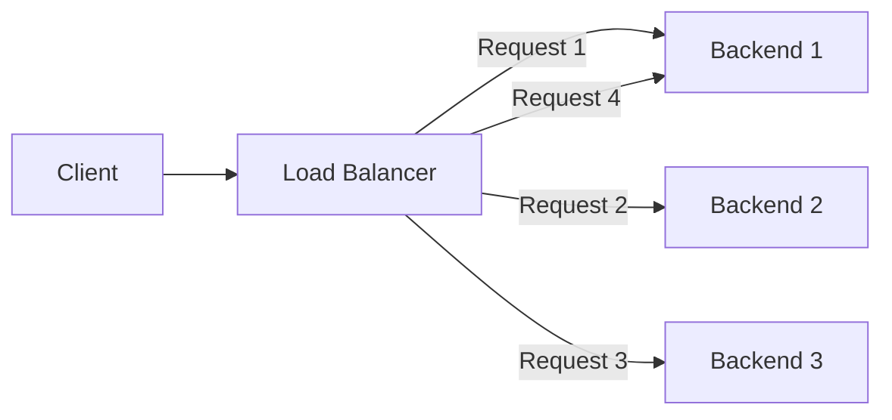
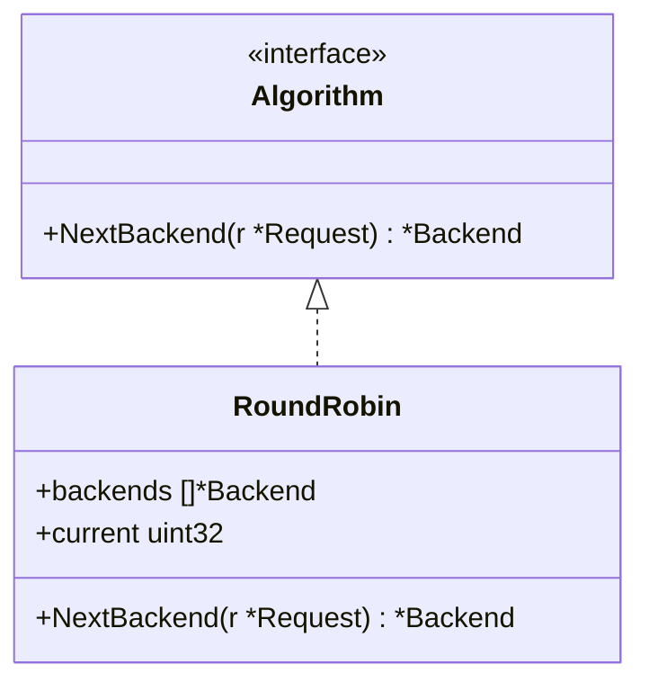
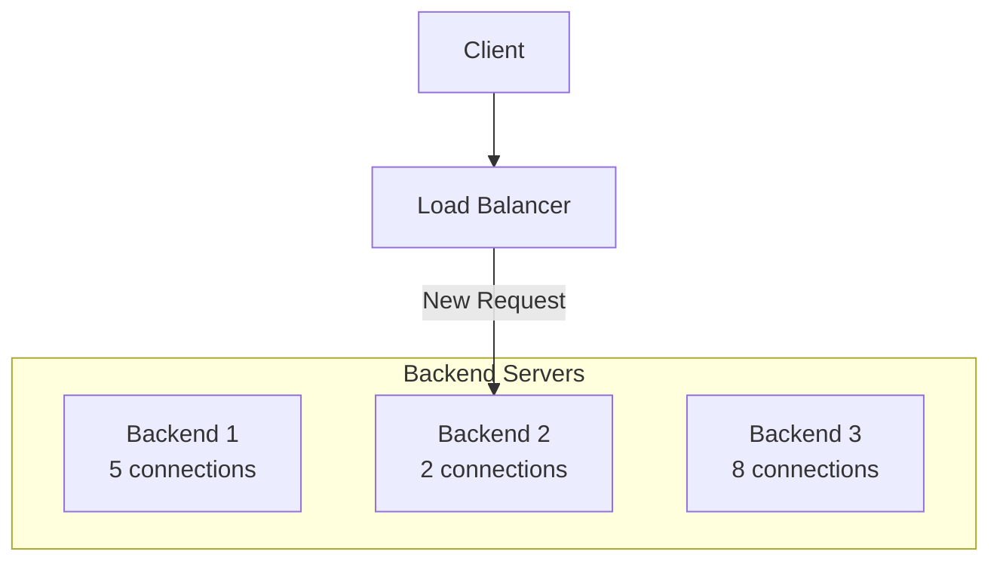
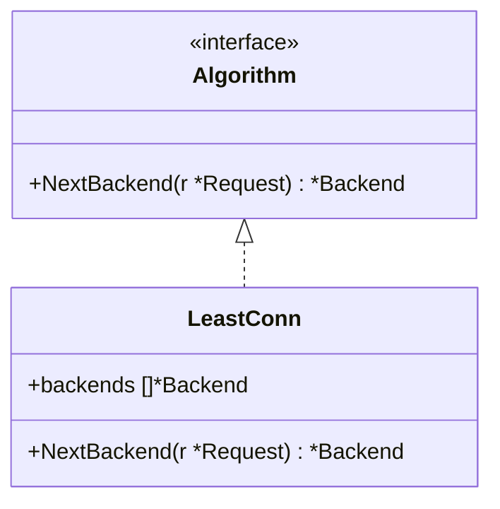
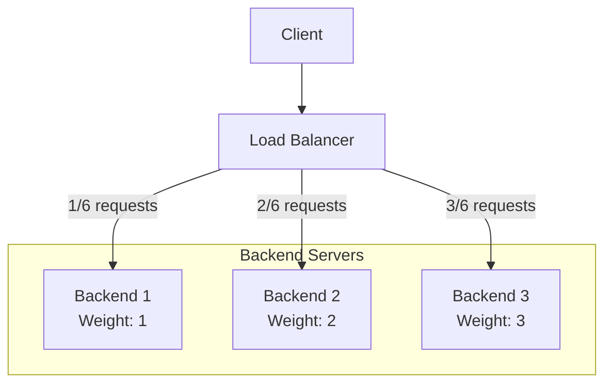
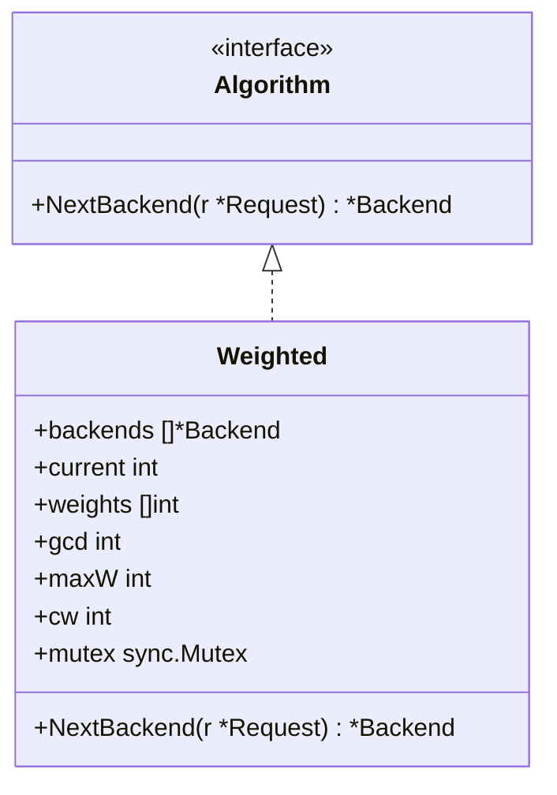

# Load Balancing Algorithms

The Go Load Balancer implements several load balancing algorithms to distribute traffic across backend servers. Each algorithm has its own strengths and is suitable for different scenarios.

## Algorithm Interface

All load balancing algorithms implement the common `Algorithm` interface:

```go
type Algorithm interface {
    // NextBackend selects the next backend for a request
    NextBackend(r *http.Request) *backend.Backend
}
```

This interface allows for easy extension with new algorithms while maintaining compatibility with the existing system.

## Available Algorithms

### Round Robin

The Round Robin algorithm distributes requests sequentially among the available backends in a circular order. It's simple, predictable, and ensures an even distribution of requests.



#### Implementation Details



The Round Robin algorithm uses atomic operations to ensure thread safety when incrementing the counter:

```go
// NextBackend selects the next backend in a round-robin fashion
func (rr *RoundRobin) NextBackend(r *http.Request) *backend.Backend {
    // Get only healthy backends
    healthyBackends := getHealthyBackends(rr.backends)
    if len(healthyBackends) == 0 {
        return nil
    }
    
    // Get the next index in a thread-safe way
    idx := int(atomic.AddUint32(&rr.current, 1) - 1) % len(healthyBackends)
    return healthyBackends[idx]
}
```

### Least Connections

The Least Connections algorithm directs traffic to the backend with the fewest active connections. This helps distribute load more evenly when requests have varying processing times.



#### Implementation Details



The Least Connections algorithm selects the backend with the minimum number of active connections:

```go
// NextBackend selects the backend with the least active connections
func (lc *LeastConn) NextBackend(r *http.Request) *backend.Backend {
    // Get only healthy backends
    healthyBackends := getHealthyBackends(lc.backends)
    if len(healthyBackends) == 0 {
        return nil
    }
    
    // Find the backend with the least connections
    var selected *backend.Backend
    minConn := -1
    
    for _, b := range healthyBackends {
        conns := b.GetActiveConnections()
        if minConn == -1 || conns < minConn {
            minConn = conns
            selected = b
        }
    }
    
    return selected
}
```

### Weighted Round Robin

The Weighted Round Robin algorithm assigns different weights to backends, allowing more powerful servers to receive proportionally more requests.



#### Implementation Details



The Weighted Round Robin algorithm uses the greatest common divisor (GCD) of the weights to ensure a fair distribution:

```go
// NextBackend selects the next backend using weighted round-robin
func (w *Weighted) NextBackend(r *http.Request) *backend.Backend {
    w.mutex.Lock()
    defer w.mutex.Unlock()
    
    // Get only healthy backends
    healthyBackends := getHealthyBackends(w.backends)
    if len(healthyBackends) == 0 {
        return nil
    }
    
    // Weighted round-robin algorithm
    for {
        w.current = (w.current + 1) % len(healthyBackends)
        if w.current == 0 {
            w.cw = w.cw - w.gcd
            if w.cw <= 0 {
                w.cw = w.maxW
            }
        }
        
        if healthyWeights[w.current] >= w.cw {
            return healthyBackends[w.current]
        }
    }
}
```

## Algorithm Selection

The algorithm to use is specified in the configuration for each backend pool:

```yaml
backend_pools:
  - name: "web-servers"
    algorithm: "round_robin"  # Options: round_robin, least_conn, weighted
    backends:
      - url: "http://localhost:3001"
        weight: 1
      - url: "http://localhost:3002"
        weight: 2
```

## Algorithm Comparison

| Algorithm | Pros | Cons | Best For |
|-----------|------|------|----------|
| Round Robin | Simple, predictable, fair | Doesn't account for varying request complexity or server capacity | Even workloads, similar server capacities |
| Least Connections | Adapts to varying request processing times | May overload new servers that have few connections | Varying request complexity |
| Weighted | Accounts for different server capacities | Requires manual weight configuration | Heterogeneous server environments |

## Algorithm Performance

The following chart shows a comparison of the algorithms under different load conditions:

```mermaid
gantt
    title Algorithm Performance Comparison
    dateFormat X
    axisFormat %s
    
    section Round Robin
    Low Load      : 0, 5
    Medium Load   : 0, 10
    High Load     : 0, 15
    
    section Least Connections
    Low Load      : 0, 4
    Medium Load   : 0, 8
    High Load     : 0, 12
    
    section Weighted
    Low Load      : 0, 4
    Medium Load   : 0, 9
    High Load     : 0, 14
```



## Implementing Custom Algorithms

To implement a custom load balancing algorithm:

1. Create a new type that implements the `Algorithm` interface
2. Implement the `NextBackend` method to select a backend based on your algorithm
3. Register your algorithm in the `serverpool` package

Example of a custom algorithm:

```go
type IPHash struct {
    backends []*backend.Backend
}

func NewIPHash(backends []*backend.Backend) *IPHash {
    return &IPHash{
        backends: backends,
    }
}

func (ih *IPHash) NextBackend(r *http.Request) *backend.Backend {
    // Get only healthy backends
    healthyBackends := getHealthyBackends(ih.backends)
    if len(healthyBackends) == 0 {
        return nil
    }
    
    // Extract client IP
    ip := getClientIP(r)
    
    // Hash the IP to get a consistent backend
    hash := hashString(ip)
    idx := hash % len(healthyBackends)
    
    return healthyBackends[idx]
}
```
