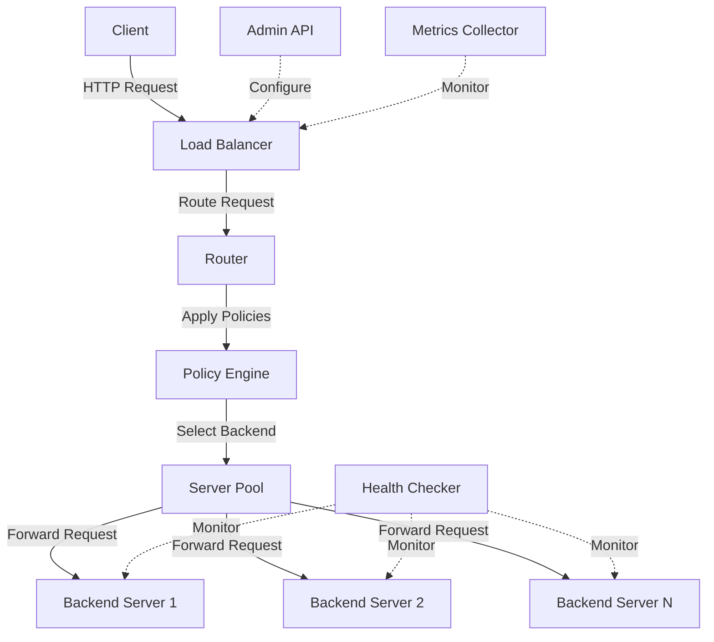
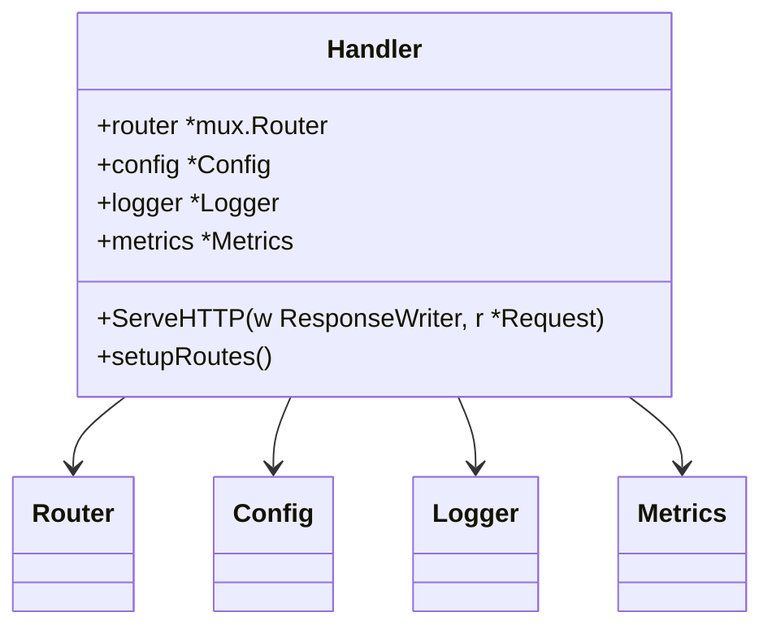
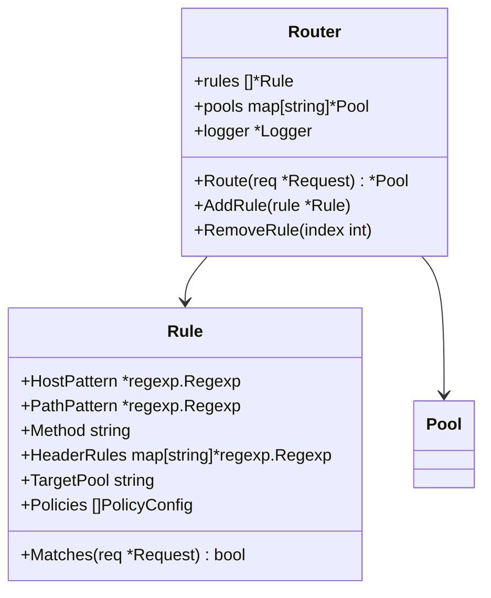
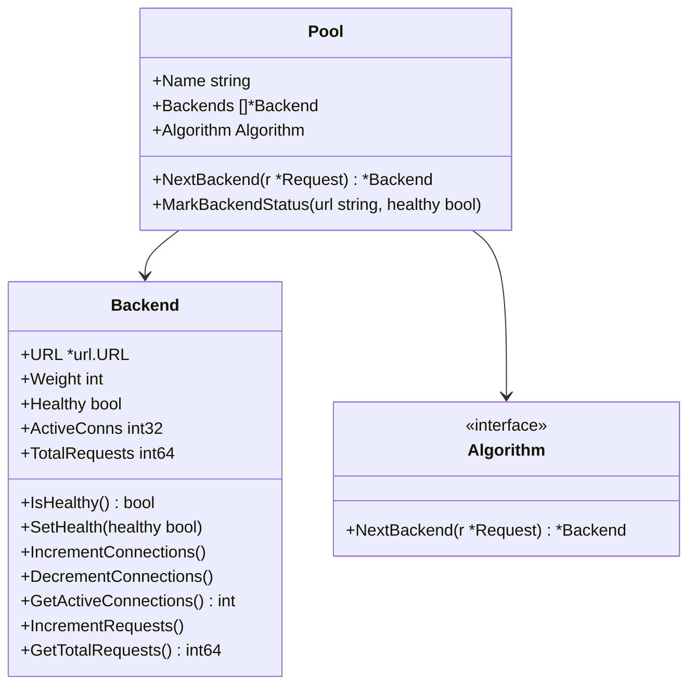
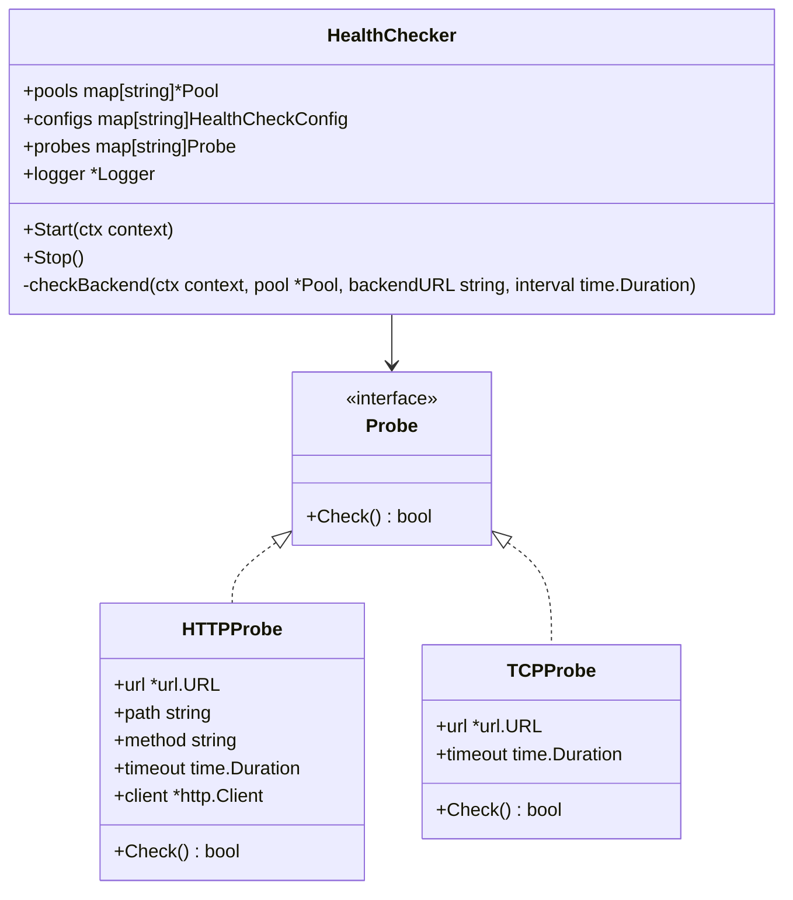
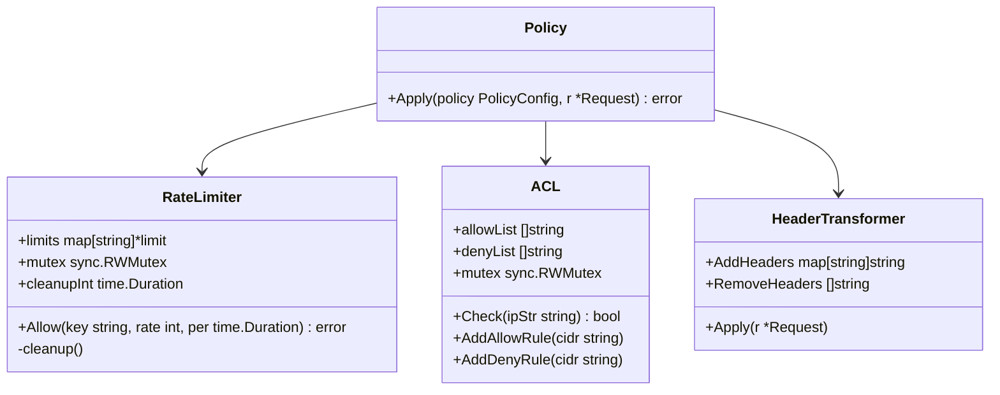
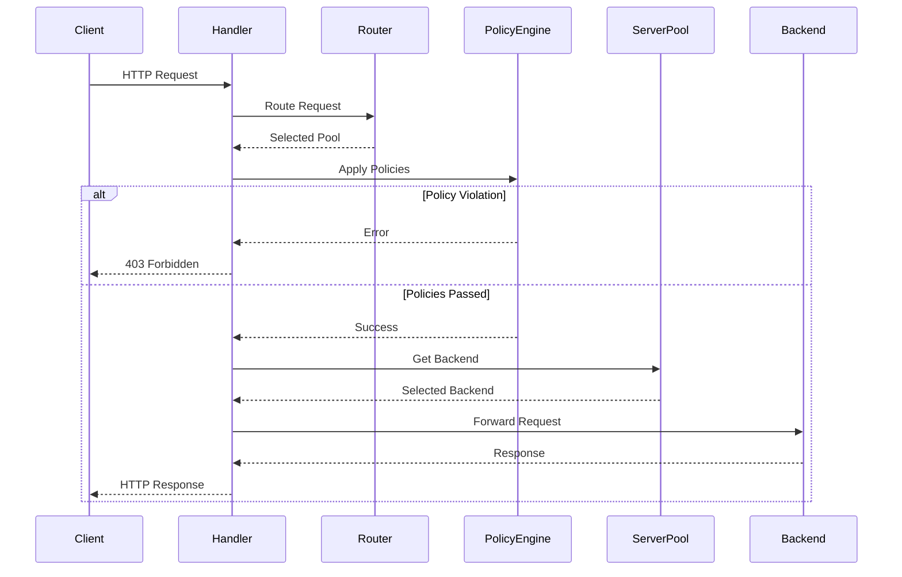
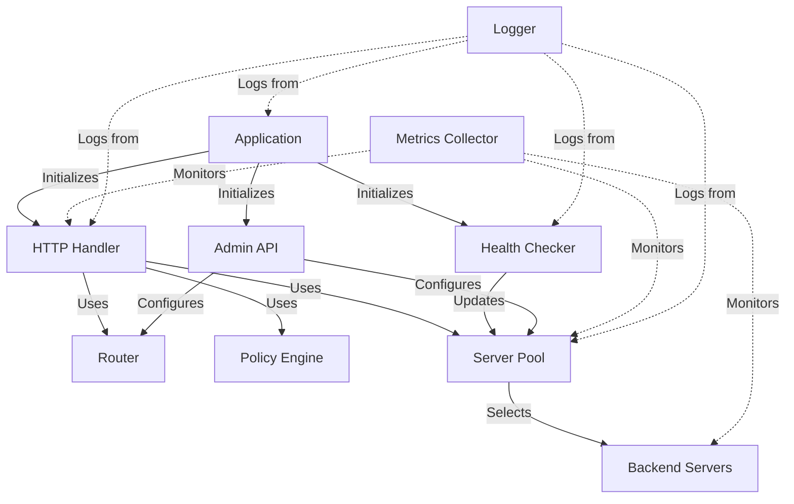
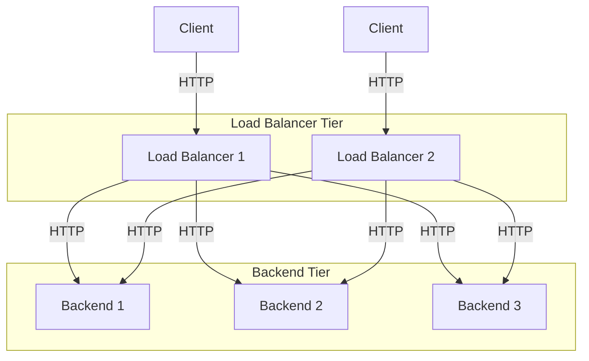

# Architecture Overview

The Go Load Balancer is designed with modularity and extensibility in mind. This document outlines the high-level architecture and component interactions.

## System Architecture

The load balancer follows a layered architecture pattern, with clear separation of concerns between components. This design allows for easy extension and modification of individual components without affecting the rest of the system.

## Core Components

### HTTP Handler

The HTTP handler is the entry point for all incoming requests. It is responsible for:

- Accepting incoming HTTP connections
- Parsing HTTP requests
- Routing requests to the appropriate backend
- Handling errors and returning appropriate responses

### Router

The router determines which backend pool should handle a request based on configurable rules. It supports matching on:

- Host
- Path
- HTTP method
- Headers

### Server Pool

The server pool manages a group of backend servers and implements load balancing algorithms to distribute requests among them.

### Health Checker

The health checker continuously monitors the health of backend servers and updates their status in the server pool.

### Policy Engine

The policy engine applies configurable policies to requests, such as rate limiting, access control, and header transformation.

## Data Flow

The following diagram illustrates the data flow through the system when processing a request:

## Component Interactions

The following diagram shows how the different components interact with each other:

## Deployment Architecture

The load balancer can be deployed in various configurations, depending on the requirements:

## Extension Points

The architecture is designed to be extensible in several ways:

1. **Load Balancing Algorithms**: New algorithms can be added by implementing the Algorithm interface
2. **Health Check Probes**: Additional health check types can be added
3. **Routing Rules**: The routing engine can be extended with new matching criteria
4. **Policies**: New policy types can be implemented and integrated
5. **Metrics and Monitoring**: Additional observability integrations can be added
