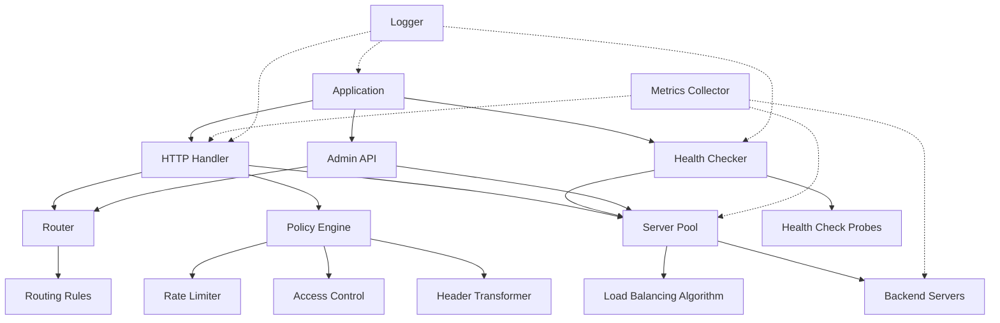
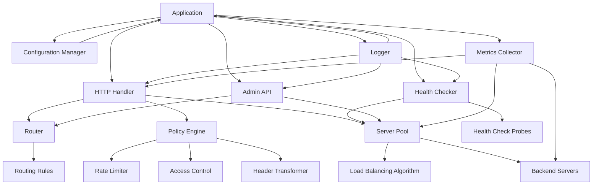

# Components

The Go Load Balancer is built with a modular architecture, consisting of several key components that work together to provide a complete load balancing solution. This document describes each component in detail.

## Component Overview



## HTTP Handler

The HTTP handler is the entry point for all incoming requests. It is responsible for accepting connections, parsing HTTP requests, and routing them to the appropriate backend.

### Key Features

- HTTP/HTTPS support
- Request routing based on configurable rules
- Policy enforcement
- Metrics collection
- Logging

### Implementation

```go
// Handler handles HTTP requests
type Handler struct {
    router  *mux.Router
    config  *configs.Config
    logger  *logging.Logger
    metrics *metrics.Metrics
}

// ServeHTTP implements the http.Handler interface
func (h *Handler) ServeHTTP(w http.ResponseWriter, r *http.Request) {
    start := time.Now()
    h.router.ServeHTTP(w, r)
    duration := time.Since(start)
    h.metrics.RecordRequestDuration(r.URL.Path, r.Method, duration)
}
```

## Router

The router determines which backend pool should handle a request based on configurable rules. It supports matching on host, path, HTTP method, and headers.

### Key Features

- Host-based routing
- Path-based routing
- Method-based routing
- Header-based routing
- Regular expression support

### Implementation

```go
// Router handles request routing
type Router struct {
    rules  []*Rule
    pools  map[string]*serverpool.Pool
    logger *logging.Logger
}

// Route routes a request to the appropriate backend pool
func (r *Router) Route(req *http.Request) (*serverpool.Pool, error) {
    // Find matching rule
    for _, rule := range r.rules {
        if rule.Matches(req) {
            // Get the target pool
            pool, ok := r.pools[rule.TargetPool]
            if !ok {
                r.logger.Error("Target pool not found", "pool", rule.TargetPool)
                continue
            }
            return pool, nil
        }
    }

    return nil, ErrNoMatchingRule
}
```

## Server Pool

The server pool manages a group of backend servers and implements load balancing algorithms to distribute requests among them.

### Key Features

- Multiple load balancing algorithms
- Backend health tracking
- Connection tracking
- Request counting

### Implementation

```go
// Pool represents a group of backend servers
type Pool struct {
    Name      string
    Backends  []*backend.Backend
    Algorithm algorithms.Algorithm
    mutex     sync.RWMutex
}

// NextBackend selects the next backend for a request
func (p *Pool) NextBackend(r *http.Request) (*backend.Backend, error) {
    p.mutex.RLock()
    defer p.mutex.RUnlock()

    // Get healthy backends
    healthyBackends := make([]*backend.Backend, 0, len(p.Backends))
    for _, b := range p.Backends {
        if b.IsHealthy() {
            healthyBackends = append(healthyBackends, b)
        }
    }

    if len(healthyBackends) == 0 {
        return nil, errors.New("no healthy backends available")
    }

    // Select backend using the algorithm
    b := p.Algorithm.NextBackend(r)
    if b == nil {
        return nil, errors.New("failed to select backend")
    }

    // Update backend stats
    b.IncrementRequests()
    b.IncrementConnections()

    return b, nil
}
```

## Health Checker

The health checker continuously monitors the health of backend servers and updates their status in the server pool.

### Key Features

- HTTP health checks
- TCP health checks
- Configurable check intervals
- Configurable timeouts
- Automatic backend status updates

### Implementation

```go
// HealthChecker monitors backend health
type HealthChecker struct {
    pools      map[string]*serverpool.Pool
    configs    map[string]configs.HealthCheckConfig
    probes     map[string]probes.Probe
    logger     *logging.Logger
    stopCh     chan struct{}
    cancelFunc context.CancelFunc
}

// Start begins health checking
func (hc *HealthChecker) Start(ctx context.Context) {
    ctx, hc.cancelFunc = context.WithCancel(ctx)

    // Create probes for each backend
    for poolName, pool := range hc.pools {
        config, ok := hc.configs[poolName]
        if !ok {
            hc.logger.Warn("No health check config for pool", "pool", poolName)
            continue
        }

        for _, backend := range pool.Backends {
            var probe probes.Probe
            switch {
            case config.Path != "":
                probe = probes.NewHTTPProbe(backend.URL, config.Path, config.Method, config.Timeout)
            default:
                probe = probes.NewTCPProbe(backend.URL, config.Timeout)
            }

            backendURL := backend.URL.String()
            hc.probes[backendURL] = probe

            // Start health check for this backend
            go hc.checkBackend(ctx, pool, backend.URL.String(), config.Interval)
        }
    }
}
```

## Policy Engine

The policy engine applies configurable policies to requests, such as rate limiting, access control, and header transformation.

### Key Features

- Rate limiting
- IP-based access control
- Header transformation
- Policy chaining

### Implementation

```go
// Apply applies a policy to a request
func Apply(policy configs.PolicyConfig, r *http.Request) error {
    // Apply rate limiting
    if policy.RateLimit != "" {
        if err := ratelimit.Apply(policy.RateLimit, r); err != nil {
            return fmt.Errorf("rate limit policy failed: %w", err)
        }
    }

    // Apply ACL
    if policy.ACL != "" {
        if err := security.Apply(policy.ACL, r); err != nil {
            return fmt.Errorf("ACL policy failed: %w", err)
        }
    }

    // Apply transformations
    if policy.Transform != "" {
        if err := transform.Apply(policy.Transform, r); err != nil {
            return fmt.Errorf("transform policy failed: %w", err)
        }
    }

    return nil
}
```

## Rate Limiter

The rate limiter implements request rate limiting based on client IP or other identifiers.

### Key Features

- Token bucket algorithm
- Configurable rates
- Configurable time windows
- IP-based rate limiting

### Implementation

```go
// RateLimiter implements rate limiting
type RateLimiter struct {
    limits     map[string]*limit
    mutex      sync.RWMutex
    cleanupInt time.Duration
}

// Allow checks if a request is allowed based on rate limits
func (rl *RateLimiter) Allow(key string, rate int, per time.Duration) error {
    rl.mutex.Lock()
    defer rl.mutex.Unlock()

    l, exists := rl.limits[key]
    if !exists {
        // Create new limit for this key
        l = &limit{
            tokens:     rate,
            lastRefill: time.Now(),
            rate:       rate,
            per:        per,
        }
        rl.limits[key] = l
    } else {
        // Refill tokens based on elapsed time
        now := time.Now()
        elapsed := now.Sub(l.lastRefill)
        tokensToAdd := int(float64(elapsed) / float64(per) * float64(rate))
        
        if tokensToAdd > 0 {
            l.tokens = min(l.rate, l.tokens+tokensToAdd)
            l.lastRefill = now
        }
    }

    // Check if we have tokens available
    if l.tokens <= 0 {
        return errors.New("rate limit exceeded")
    }

    // Consume a token
    l.tokens--
    return nil
}
```

## Access Control List (ACL)

The ACL component implements IP-based access control for requests.

### Key Features

- IP whitelist/blacklist
- CIDR support
- Header-based client IP detection

### Implementation

```go
// ACL implements access control lists
type ACL struct {
    allowList []string
    denyList  []string
    mutex     sync.RWMutex
}

// Check checks if an IP is allowed by the ACL
func (a *ACL) Check(ipStr string) bool {
    a.mutex.RLock()
    defer a.mutex.RUnlock()

    ip := net.ParseIP(ipStr)
    if ip == nil {
        return false
    }

    // Check deny list first
    for _, cidr := range a.denyList {
        _, ipNet, err := net.ParseCIDR(cidr)
        if err != nil {
            continue
        }
        if ipNet.Contains(ip) {
            return false
        }
    }

    // If allow list is empty, allow all
    if len(a.allowList) == 0 {
        return true
    }

    // Check allow list
    for _, cidr := range a.allowList {
        _, ipNet, err := net.ParseCIDR(cidr)
        if err != nil {
            continue
        }
        if ipNet.Contains(ip) {
            return true
        }
    }

    return false
}
```

## Header Transformer

The header transformer modifies request and response headers based on configurable rules.

### Key Features

- Add headers
- Remove headers
- Set headers
- Path rewriting
- Query parameter manipulation

### Implementation

```go
// Apply applies transformation rules to a request
func Apply(transformStr string, r *http.Request) error {
    // Parse transform string (e.g., "add-header:X-Forwarded-Host:example.com,remove-header:Referer")
    rules := strings.Split(transformStr, ",")

    for _, rule := range rules {
        parts := strings.SplitN(rule, ":", 3)
        if len(parts) < 2 {
            continue
        }

        action := strings.ToLower(parts[0])
        
        switch action {
        case "add-header":
            if len(parts) != 3 {
                return errors.New("invalid add-header format")
            }
            r.Header.Add(parts[1], parts[2])
            
        case "set-header":
            if len(parts) != 3 {
                return errors.New("invalid set-header format")
            }
            r.Header.Set(parts[1], parts[2])
            
        case "remove-header":
            r.Header.Del(parts[1])
            
        case "rewrite-path":
            if len(parts) != 3 {
                return errors.New("invalid rewrite-path format")
            }
            r.URL.Path = strings.Replace(r.URL.Path, parts[1], parts[2], 1)
            
        case "add-query":
            if len(parts) != 3 {
                return errors.New("invalid add-query format")
            }
            q := r.URL.Query()
            q.Add(parts[1], parts[2])
            r.URL.RawQuery = q.Encode()
            
        default:
            return errors.New("unknown transform action: " + action)
        }
    }

    return nil
}
```

## Admin API

The admin API provides runtime configuration and monitoring capabilities.

### Key Features

- Status monitoring
- Backend management
- Metrics access
- Configuration updates

### Implementation

```go
// API handles admin API requests
type API struct {
    pools   map[string]*serverpool.Pool
    logger  *logging.Logger
    metrics *metrics.Metrics
}

// RegisterHandlers registers admin API handlers
func (a *API) RegisterHandlers(mux *http.ServeMux, basePath string) {
    mux.HandleFunc(basePath+"/status", a.handleStatus)
    mux.HandleFunc(basePath+"/backends", a.handleBackends)
    mux.HandleFunc(basePath+"/metrics", a.handleMetrics)
}

// handleBackends handles backend management requests
func (a *API) handleBackends(w http.ResponseWriter, r *http.Request) {
    switch r.Method {
    case http.MethodGet:
        // List backends
        result := make(map[string][]map[string]interface{})

        for name, pool := range a.pools {
            backends := make([]map[string]interface{}, 0, len(pool.Backends))
            for _, b := range pool.Backends {
                backends = append(backends, map[string]interface{}{
                    "url":            b.URL.String(),
                    "healthy":        b.IsHealthy(),
                    "active_conns":   b.GetActiveConnections(),
                    "total_requests": b.GetTotalRequests(),
                    "weight":         b.Weight,
                })
            }
            result[name] = backends
        }

        w.Header().Set("Content-Type", "application/json")
        json.NewEncoder(w).Encode(result)

    case http.MethodPost:
        // Update backend status
        var req struct {
            Pool    string `json:"pool"`
            URL     string `json:"url"`
            Healthy bool   `json:"healthy"`
        }

        if err := json.NewDecoder(r.Body).Decode(&req); err != nil {
            http.Error(w, "Invalid request", http.StatusBadRequest)
            return
        }

        pool, ok := a.pools[req.Pool]
        if !ok {
            http.Error(w, "Pool not found", http.StatusNotFound)
            return
        }

        pool.MarkBackendStatus(req.URL, req.Healthy)
        w.WriteHeader(http.StatusOK)

    default:
        http.Error(w, "Method not allowed", http.StatusMethodNotAllowed)
    }
}
```

## Metrics Collector

The metrics collector gathers and exposes performance metrics for the load balancer.

### Key Features

- Request counting
- Request duration tracking
- Backend latency tracking
- Connection tracking
- Backend health tracking

### Implementation

```go
// Metrics collects and exposes application metrics
type Metrics struct {
    requestCounter   *prometheus.CounterVec
    requestDuration  *prometheus.HistogramVec
    backendLatency   *prometheus.HistogramVec
    activeConnections *prometheus.GaugeVec
    backendHealth    *prometheus.GaugeVec
}

// RecordRequestDuration records the duration of a request
func (m *Metrics) RecordRequestDuration(path, method string, duration time.Duration) {
    m.requestDuration.WithLabelValues(path, method).Observe(duration.Seconds())
}

// RecordBackendLatency records the latency of a backend request
func (m *Metrics) RecordBackendLatency(backend string, duration time.Duration) {
    m.backendLatency.WithLabelValues(backend).Observe(duration.Seconds())
}

// SetActiveConnections sets the number of active connections for a backend
func (m *Metrics) SetActiveConnections(backend string, count int) {
    m.activeConnections.WithLabelValues(backend).Set(float64(count))
}

// SetBackendHealth sets the health status of a backend
func (m *Metrics) SetBackendHealth(backend string, healthy bool) {
    var value float64
    if healthy {
        value = 1
    }
    m.backendHealth.WithLabelValues(backend).Set(value)
}
```

## Logger

The logger provides structured logging for the load balancer.

### Key Features

- Structured logging
- Multiple log levels
- Environment-based configuration

### Implementation

```go
// Logger wraps the underlying logging implementation
type Logger struct {
    logger *logrus.Logger
}

// NewLogger creates a new logger instance
func NewLogger() *Logger {
    log := logrus.New()
    log.SetOutput(os.Stdout)
    log.SetFormatter(&logrus.TextFormatter{
        FullTimestamp: true,
    })

    // Set log level from environment variable or default to info
    level := os.Getenv("LOG_LEVEL")
    switch level {
    case "debug":
        log.SetLevel(logrus.DebugLevel)
    case "warn":
        log.SetLevel(logrus.WarnLevel)
    case "error":
        log.SetLevel(logrus.ErrorLevel)
    default:
        log.SetLevel(logrus.InfoLevel)
    }

    return &Logger{
        logger: log,
    }
}

// Info logs an info message
func (l *Logger) Info(msg string, args ...interface{}) {
    if len(args) == 0 {
        l.logger.Info(msg)
        return
    }

    fields := makeFields(args...)
    l.logger.WithFields(fields).Info(msg)
}
```

## Configuration Manager

The configuration manager loads and parses configuration from various sources.

### Key Features

- YAML configuration
- Environment variable support
- Command-line flag support
- Configuration validation

### Implementation

```go
// LoadConfig loads configuration from the specified file
func LoadConfig(path string) (*Config, error) {
    // Initialize koanf
    k := koanf.New(".")
    
    // Load default values
    k.Load(structs.Provider(DefaultConfig(), "yaml"), nil)
    
    // Load from YAML file
    if err := k.Load(file.Provider(path), yaml.Parser()); err != nil {
        return nil, fmt.Errorf("failed to load config file: %w", err)
    }
    
    // Load from environment variables
    k.Load(env.Provider("LB_", ".", func(s string) string {
        return strings.Replace(strings.ToLower(
            strings.TrimPrefix(s, "LB_")), "_", ".", -1)
    }), nil)
    
    // Unmarshal into Config struct
    var config Config
    if err := k.Unmarshal("", &config); err != nil {
        return nil, fmt.Errorf("failed to unmarshal config: %w", err)
    }
    
    // Validate configuration
    if err := validateConfig(&config); err != nil {
        return nil, fmt.Errorf("invalid configuration: %w", err)
    }
    
    return &config, nil
}
```

## Component Dependencies

The following diagram shows the dependencies between components:


