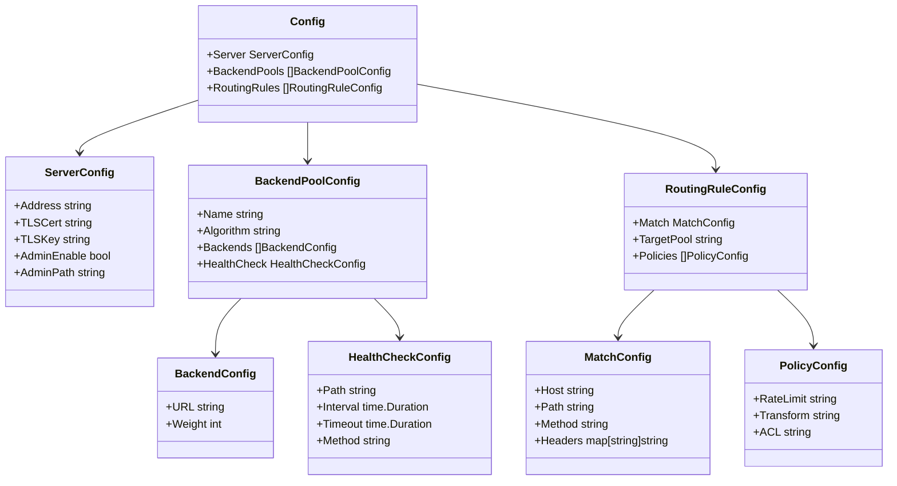
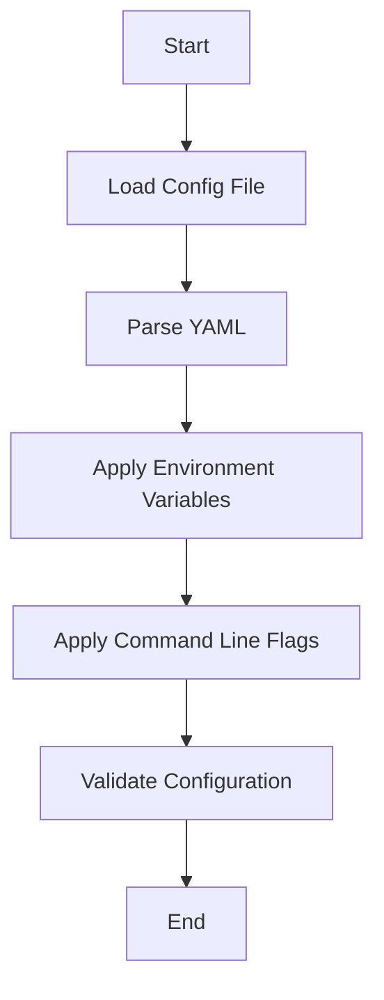

# Configuration Guide

The Go Load Balancer uses a flexible configuration system that supports YAML files, environment variables, and command-line flags. This guide explains the configuration options and how to use them.

## Configuration Structure

The configuration is organized into several sections:



## Configuration File

The default configuration file is located at `configs/config.yml`. Here's an example configuration:

```yaml
server:
  address: ":8080"
  admin_enable: true
  admin_path: "/admin"
  
backend_pools:
  - name: "web-servers"
    algorithm: "round_robin"
    backends:
      - url: "http://localhost:3001"
        weight: 1
      - url: "http://localhost:3002"
        weight: 2
    health_check:
      path: "/health"
      interval: "30s"
      timeout: "5s"

routing_rules:
  - match:
      host: "example.com"
      path: "/api/*"
    target_pool: "web-servers"
    policies:
      - rate_limit: "100/minute"
  - match:
      path: "/*"
    target_pool: "web-servers"
    policies: []
```

## Configuration Options

### Server Configuration

| Option | Description | Default |
|--------|-------------|---------|
| `address` | The address and port to listen on | `:8080` |
| `tls_cert` | Path to TLS certificate file | `""` |
| `tls_key` | Path to TLS key file | `""` |
| `admin_enable` | Enable the admin API | `false` |
| `admin_path` | Base path for admin API endpoints | `/admin` |

### Backend Pool Configuration

| Option | Description | Default |
|--------|-------------|---------|
| `name` | Name of the backend pool | Required |
| `algorithm` | Load balancing algorithm (`round_robin`, `least_conn`, `weighted`) | `round_robin` |
| `backends` | List of backend servers | Required |
| `health_check` | Health check configuration | Optional |

#### Backend Configuration

| Option | Description | Default |
|--------|-------------|---------|
| `url` | URL of the backend server | Required |
| `weight` | Weight for weighted algorithms | `1` |

#### Health Check Configuration

| Option | Description | Default |
|--------|-------------|---------|
| `path` | Path to use for HTTP health checks | `/health` |
| `interval` | Interval between health checks | `30s` |
| `timeout` | Timeout for health check requests | `5s` |
| `method` | HTTP method for health checks | `GET` |

### Routing Rule Configuration

| Option | Description | Default |
|--------|-------------|---------|
| `match` | Criteria for matching requests | Required |
| `target_pool` | Name of the backend pool to route to | Required |
| `policies` | List of policies to apply | `[]` |

#### Match Configuration

| Option | Description | Default |
|--------|-------------|---------|
| `host` | Host pattern to match (supports wildcards) | `""` |
| `path` | Path pattern to match (supports wildcards) | `""` |
| `method` | HTTP method to match | `""` |
| `headers` | Map of headers to match | `{}` |

#### Policy Configuration

| Option | Description | Example |
|--------|-------------|---------|
| `rate_limit` | Rate limit policy | `"100/minute"` |
| `transform` | Header transformation policy | `"add-header:X-Forwarded-Host:example.com"` |
| `acl` | Access control policy | `"allow:192.168.1.0/24,deny:10.0.0.1"` |

## Configuration Loading

The configuration is loaded using the following process:



### Configuration Sources

The load balancer supports multiple configuration sources with the following precedence (highest to lowest):

1. Command-line flags
2. Environment variables
3. Configuration file
4. Default values

### Environment Variables

Environment variables can override configuration values using the following format:

- `LB_SERVER_ADDRESS`: Override server address
- `LB_ADMIN_ENABLE`: Enable/disable admin API
- `LB_LOG_LEVEL`: Set logging level

### Command-Line Flags

The following command-line flags are available:

- `--config`: Path to configuration file (default: `configs/config.yml`)
- `--address`: Override server address
- `--log-level`: Set logging level

## Using koanf for Configuration

The load balancer uses [koanf](https://github.com/knadh/koanf) for configuration management, which provides several benefits:

1. Support for multiple configuration sources
2. Automatic environment variable binding
3. Type-safe configuration access
4. Default values
5. Configuration validation

Here's how koanf is used in the configuration loader:

```go
func LoadConfig(path string) (*Config, error) {
    // Initialize koanf
    k := koanf.New(".")
    
    // Load default values
    k.Load(structs.Provider(DefaultConfig(), "yaml"), nil)
    
    // Load from YAML file
    if err := k.Load(file.Provider(path), yaml.Parser()); err != nil {
        return nil, fmt.Errorf("failed to load config file: %w", err)
    }
    
    // Load from environment variables
    k.Load(env.Provider("LB_", ".", func(s string) string {
        return strings.Replace(strings.ToLower(
            strings.TrimPrefix(s, "LB_")), "_", ".", -1)
    }), nil)
    
    // Unmarshal into Config struct
    var config Config
    if err := k.Unmarshal("", &config); err != nil {
        return nil, fmt.Errorf("failed to unmarshal config: %w", err)
    }
    
    // Validate configuration
    if err := validateConfig(&config); err != nil {
        return nil, fmt.Errorf("invalid configuration: %w", err)
    }
    
    return &config, nil
}
```

## Configuration Examples

### Basic Configuration

```yaml
server:
  address: ":8080"
  
backend_pools:
  - name: "web-servers"
    algorithm: "round_robin"
    backends:
      - url: "http://localhost:3001"
      - url: "http://localhost:3002"

routing_rules:
  - match:
      path: "/*"
    target_pool: "web-servers"
```

### TLS Configuration

```yaml
server:
  address: ":443"
  tls_cert: "/path/to/cert.pem"
  tls_key: "/path/to/key.pem"
```

### Multiple Backend Pools

```yaml
backend_pools:
  - name: "api-servers"
    algorithm: "least_conn"
    backends:
      - url: "http://api1:8000"
      - url: "http://api2:8000"
  
  - name: "web-servers"
    algorithm: "weighted"
    backends:
      - url: "http://web1:8080"
        weight: 1
      - url: "http://web2:8080"
        weight: 2

routing_rules:
  - match:
      path: "/api/*"
    target_pool: "api-servers"
  
  - match:
      path: "/*"
    target_pool: "web-servers"
```

### Advanced Routing

```yaml
routing_rules:
  - match:
      host: "api.example.com"
      path: "/v1/*"
    target_pool: "api-v1"
  
  - match:
      host: "api.example.com"
      path: "/v2/*"
    target_pool: "api-v2"
  
  - match:
      host: "www.example.com"
    target_pool: "web-servers"
  
  - match:
      headers:
        X-API-Version: "v1"
    target_pool: "api-v1"
```

### Policy Configuration

```yaml
routing_rules:
  - match:
      path: "/api/*"
    target_pool: "api-servers"
    policies:
      - rate_limit: "100/minute"
      - acl: "allow:192.168.1.0/24,deny:10.0.0.1"
      - transform: "add-header:X-Forwarded-Host:api.example.com"
```
