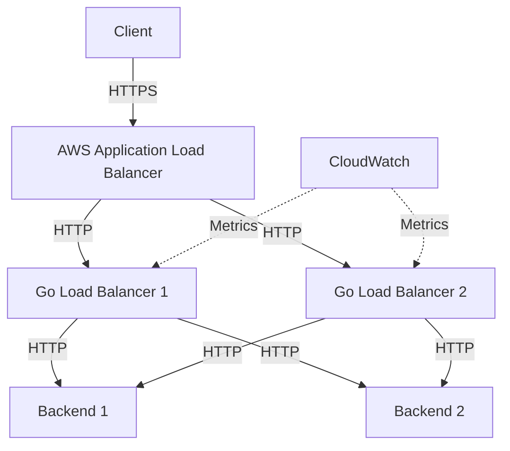
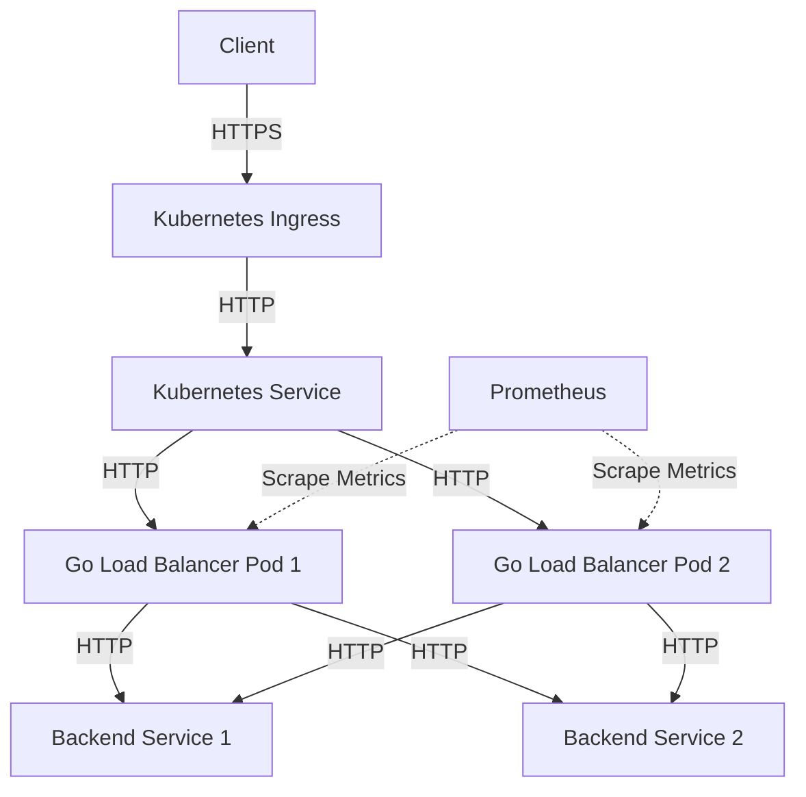

# Deployment Guide

This guide provides instructions for deploying the Go Load Balancer in various environments.

## Deployment Options

The Go Load Balancer can be deployed in several ways:

1. **Binary Deployment**: Compile and run the binary directly
2. **Docker Deployment**: Run as a Docker container
3. **Kubernetes Deployment**: Deploy on a Kubernetes cluster
4. **Systemd Service**: Run as a systemd service on Linux

## Binary Deployment

### Building the Binary

```bash
# Build for the current platform
go build -o go-lb ./cmd/go-lb

# Build for Linux
GOOS=linux GOARCH=amd64 go build -o go-lb-linux-amd64 ./cmd/go-lb

# Build for macOS
GOOS=darwin GOARCH=amd64 go build -o go-lb-darwin-amd64 ./cmd/go-lb

# Build for Windows
GOOS=windows GOARCH=amd64 go build -o go-lb-windows-amd64.exe ./cmd/go-lb
```

### Running the Binary

```bash
# Run with default configuration
./go-lb

# Run with a specific configuration file
./go-lb --config /path/to/config.yml
```

### Environment Variables

You can configure the load balancer using environment variables:

```bash
# Set the server address
export LB_SERVER_ADDRESS=":8080"

# Set the log level
export LB_LOG_LEVEL="debug"

# Run the load balancer
./go-lb
```

## Docker Deployment

### Building the Docker Image

```bash
# Build the Docker image
docker build -t go-loadbalancer:latest -f deployments/docker/Dockerfile .
```

### Running the Docker Container

```bash
# Run with default configuration
docker run -p 8080:8080 go-loadbalancer:latest

# Run with a custom configuration
docker run -p 8080:8080 -v /path/to/config.yml:/app/configs/config.yml go-loadbalancer:latest

# Run with environment variables
docker run -p 8080:8080 -e LB_SERVER_ADDRESS=":8080" -e LB_LOG_LEVEL="debug" go-loadbalancer:latest
```

### Docker Compose

Create a `docker-compose.yml` file:

```yaml
version: '3'

services:
  loadbalancer:
    image: go-loadbalancer:latest
    build:
      context: .
      dockerfile: deployments/docker/Dockerfile
    ports:
      - "8080:8080"
    volumes:
      - ./configs/config.yml:/app/configs/config.yml
    environment:
      - LB_LOG_LEVEL=info
    restart: unless-stopped
    
  backend1:
    image: nginx:alpine
    volumes:
      - ./test/backend1:/usr/share/nginx/html
    
  backend2:
    image: nginx:alpine
    volumes:
      - ./test/backend2:/usr/share/nginx/html
```

Run with Docker Compose:

```bash
docker-compose up -d
```

## Kubernetes Deployment

### Creating Kubernetes Manifests

Create a deployment manifest (`deployments/kubernetes/deployment.yaml`):

```yaml
apiVersion: apps/v1
kind: Deployment
metadata:
  name: go-loadbalancer
  labels:
    app: go-loadbalancer
spec:
  replicas: 2
  selector:
    matchLabels:
      app: go-loadbalancer
  template:
    metadata:
      labels:
        app: go-loadbalancer
    spec:
      containers:
      - name: go-loadbalancer
        image: go-loadbalancer:latest
        imagePullPolicy: Always
        ports:
        - containerPort: 8080
        volumeMounts:
        - name: config-volume
          mountPath: /app/configs
        env:
        - name: LB_LOG_LEVEL
          value: "info"
        livenessProbe:
          httpGet:
            path: /health
            port: 8080
          initialDelaySeconds: 5
          periodSeconds: 10
        readinessProbe:
          httpGet:
            path: /health
            port: 8080
          initialDelaySeconds: 5
          periodSeconds: 10
      volumes:
      - name: config-volume
        configMap:
          name: go-loadbalancer-config
```

Create a service manifest (`deployments/kubernetes/service.yaml`):

```yaml
apiVersion: v1
kind: Service
metadata:
  name: go-loadbalancer
spec:
  selector:
    app: go-loadbalancer
  ports:
  - port: 80
    targetPort: 8080
  type: LoadBalancer
```

Create a ConfigMap for the configuration (`deployments/kubernetes/configmap.yaml`):

```yaml
apiVersion: v1
kind: ConfigMap
metadata:
  name: go-loadbalancer-config
data:
  config.yml: |
    server:
      address: ":8080"
      
    backend_pools:
      - name: "web-servers"
        algorithm: "round_robin"
        backends:
          - url: "http://backend1-service:80"
            weight: 1
          - url: "http://backend2-service:80"
            weight: 1
        health_check:
          path: "/health"
          interval: "10s"
          timeout: "2s"
    
    routing_rules:
      - match:
          path: "/*"
        target_pool: "web-servers"
```

### Deploying to Kubernetes

```bash
# Apply the ConfigMap
kubectl apply -f deployments/kubernetes/configmap.yaml

# Apply the deployment
kubectl apply -f deployments/kubernetes/deployment.yaml

# Apply the service
kubectl apply -f deployments/kubernetes/service.yaml
```

### Helm Chart

For more complex deployments, create a Helm chart in `deployments/helm/go-loadbalancer/`:

```
deployments/helm/go-loadbalancer/
├── Chart.yaml
├── values.yaml
└── templates/
    ├── deployment.yaml
    ├── service.yaml
    └── configmap.yaml
```

Deploy with Helm:

```bash
helm install go-loadbalancer deployments/helm/go-loadbalancer
```

## Systemd Service

Create a systemd service file (`/etc/systemd/system/go-loadbalancer.service`):

```ini
[Unit]
Description=Go Load Balancer
After=network.target

[Service]
User=loadbalancer
Group=loadbalancer
WorkingDirectory=/opt/go-loadbalancer
ExecStart=/opt/go-loadbalancer/go-lb --config /opt/go-loadbalancer/configs/config.yml
Restart=always
RestartSec=5
LimitNOFILE=65536

Environment=LB_LOG_LEVEL=info

[Install]
WantedBy=multi-user.target
```

Enable and start the service:

```bash
sudo systemctl enable go-loadbalancer
sudo systemctl start go-loadbalancer
```

## Monitoring Setup

### Prometheus Integration

Create a Prometheus configuration file (`deployments/prometheus/prometheus.yml`):

```yaml
global:
  scrape_interval: 15s

scrape_configs:
  - job_name: 'go-loadbalancer'
    static_configs:
      - targets: ['loadbalancer:8080']
```

Run Prometheus with Docker:

```bash
docker run -d --name prometheus \
  -p 9090:9090 \
  -v $(pwd)/deployments/prometheus/prometheus.yml:/etc/prometheus/prometheus.yml \
  prom/prometheus
```

### Grafana Dashboard

Create a Grafana dashboard configuration (`deployments/grafana/dashboard.json`).

Run Grafana with Docker:

```bash
docker run -d --name grafana \
  -p 3000:3000 \
  -v $(pwd)/deployments/grafana:/var/lib/grafana/dashboards \
  grafana/grafana
```

### Docker Compose for Monitoring

Create a Docker Compose file for monitoring (`docker-compose.monitoring.yml`):

```yaml
version: '3'

services:
  loadbalancer:
    image: go-loadbalancer:latest
    ports:
      - "8080:8080"
    volumes:
      - ./configs/config.yml:/app/configs/config.yml
    
  prometheus:
    image: prom/prometheus
    ports:
      - "9090:9090"
    volumes:
      - ./deployments/prometheus/prometheus.yml:/etc/prometheus/prometheus.yml
    
  grafana:
    image: grafana/grafana
    ports:
      - "3000:3000"
    volumes:
      - ./deployments/grafana/dashboards:/var/lib/grafana/dashboards
    environment:
      - GF_SECURITY_ADMIN_PASSWORD=admin
    depends_on:
      - prometheus
```

Run the monitoring stack:

```bash
docker-compose -f docker-compose.monitoring.yml up -d
```

## High Availability Deployment

For high availability, deploy multiple instances of the load balancer behind a cloud load balancer or using Kubernetes.

### AWS Deployment



### Kubernetes Deployment



## Security Considerations

### TLS Configuration

Enable TLS in the configuration:

```yaml
server:
  address: ":443"
  tls_cert: "/path/to/cert.pem"
  tls_key: "/path/to/key.pem"
```

### Running as Non-Root User

When deploying with Docker, use a non-root user:

```dockerfile
FROM golang:1.18-alpine AS builder
# ... build steps ...

FROM alpine:3.16
RUN addgroup -S loadbalancer && adduser -S loadbalancer -G loadbalancer
USER loadbalancer
# ... rest of Dockerfile ...
```

### Network Security

- Use a firewall to restrict access to the load balancer
- Place the load balancer in a private subnet if possible
- Use security groups or network ACLs to control traffic

## Performance Tuning

### Operating System Tuning

For Linux systems, adjust the following parameters in `/etc/sysctl.conf`:

```
# Increase the maximum number of open file descriptors
fs.file-max = 65536

# Increase the local port range
net.ipv4.ip_local_port_range = 1024 65535

# Increase TCP keepalive settings
net.ipv4.tcp_keepalive_time = 60
net.ipv4.tcp_keepalive_intvl = 10
net.ipv4.tcp_keepalive_probes = 6

# Enable TCP Fast Open
net.ipv4.tcp_fastopen = 3

# Increase the maximum number of backlog connections
net.core.somaxconn = 65536
net.core.netdev_max_backlog = 65536

# Increase TCP read/write buffer limits
net.core.rmem_max = 16777216
net.core.wmem_max = 16777216
```

Apply the changes:

```bash
sudo sysctl -p
```

### Go Runtime Tuning

Set the following environment variables:

```bash
# Set the number of CPU cores to use
export GOMAXPROCS=8

# Set the garbage collection target percentage
export GOGC=100
```

### Load Balancer Configuration

Optimize the load balancer configuration:

```yaml
server:
  address: ":8080"
  max_connections: 10000
  read_timeout: "30s"
  write_timeout: "30s"
  idle_timeout: "60s"
```

## Deployment Checklist

- [ ] Configure proper logging
- [ ] Set up monitoring and alerting
- [ ] Configure health checks
- [ ] Set up TLS if needed
- [ ] Configure firewall rules
- [ ] Test failover scenarios
- [ ] Implement backup and restore procedures
- [ ] Document the deployment
