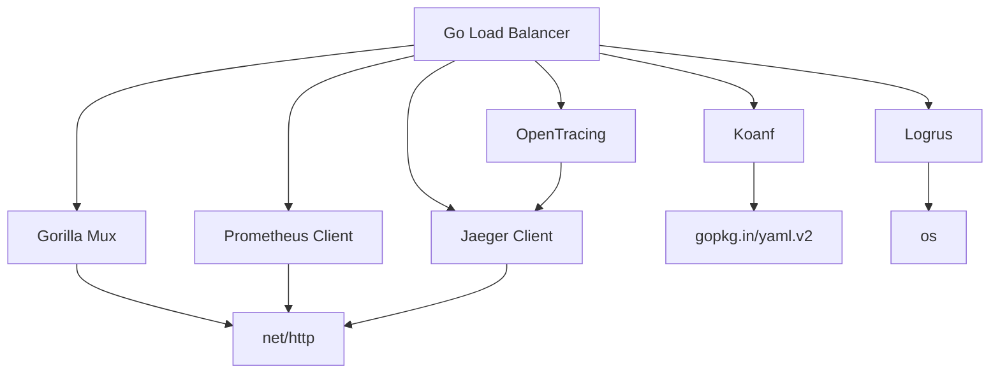

# Development Guide

This guide provides information for developers who want to contribute to or extend the Go Load Balancer project.

## Project Structure

The project follows the standard Go project layout:

```
go-loadbalancer/
├── 📄 cmd/go-lb/                # Application entry point
│   └── main.go                  # Main application file
├── 🌐 api/                      # API definitions
│   └── http/v1/                 # HTTP API version 1
├── ⚙️  configs/                  # Configuration files and templates
│   ├── config.go                # Configuration structures
│   └── loader.go                # Configuration loading logic
├── 🔒 internal/                  # Internal business logic
│   ├── app/                     # Application initialization
│   ├── admin/                   # Admin interface
│   ├── backend/                 # Backend server management
│   ├── healthcheck/             # Health checking system
│   ├── serverpool/              # Backend pools & algorithms
│   ├── routing/                 # Request routing engine
│   ├── policy/                  # Policy enforcement
│   └── handler/                 # Core request handlers
├── 📦 pkg/                      # Reusable utilities
│   ├── logging/                 # Structured logging
│   ├── metrics/                 # Performance metrics
│   └── tracer/                  # Distributed tracing
├── 🧪 test/                     # Additional test applications
├── 🔧 scripts/                  # Scripts for various tasks
├── 🚢 deployments/              # Deployment configurations
│   └── docker/                  # Docker-related files
├── 📊 tools/                    # Tools and utilities
│   └── k6/                      # K6 load testing scripts
└── 📚 docs/                     # Documentation files
```

## Module Dependencies

The project has the following key dependencies:



## Development Environment Setup

### Prerequisites

- Go 1.23 or higher
- Git
- Make (optional, for using the Makefile)
- Docker (optional, for containerized development)

### Setting Up the Development Environment

1. Clone the repository:

```bash
git clone https://github.com/rixtrayker/go-loadbalancer.git
cd go-loadbalancer
```

2. Install dependencies:

```bash
go mod download
```

3. Build the project:

```bash
make build
# or
go build -o build/go-lb ./cmd/go-lb
```

4. Run the load balancer:

```bash
make run
# or
./build/go-lb --config configs/config.yml
```

### Running Tests

```bash
make test
# or
go test -v ./...
```

### Running Linting

```bash
make lint
# or
golangci-lint run
```

## Development Workflow

### Making Changes

1. Create a new branch for your changes:

```bash
git checkout -b feature/your-feature-name
```

2. Make your changes to the code.

3. Run tests to ensure your changes don't break existing functionality:

```bash
go test -v ./...
```

4. Run linting to ensure code quality:

```bash
golangci-lint run
```

5. Commit your changes:

```bash
git add .
git commit -m "Add your feature description"
```

6. Push your changes to your fork:

```bash
git push origin feature/your-feature-name
```

7. Create a pull request on GitHub.

### Commit Guidelines

- Use clear, descriptive commit messages
- Start with a verb in the present tense (e.g., "Add", "Fix", "Update")
- Reference issue numbers if applicable (e.g., "Fix #123: Memory leak in server pool")

## Extending the Load Balancer

### Adding a New Load Balancing Algorithm

1. Create a new file in `internal/serverpool/algorithms/` (e.g., `iphash.go`):

```go
package algorithms

import (
    "hash/fnv"
    "net/http"

    "github.com/rixtrayker/go-loadbalancer/internal/backend"
)

// IPHash implements the IP hash load balancing algorithm
type IPHash struct {
    backends []*backend.Backend
}

// NewIPHash creates a new IP hash algorithm instance
func NewIPHash(backends []*backend.Backend) *IPHash {
    return &IPHash{
        backends: backends,
    }
}

// NextBackend selects a backend based on client IP hash
func (ih *IPHash) NextBackend(r *http.Request) *backend.Backend {
    // Get only healthy backends
    healthyBackends := make([]*backend.Backend, 0, len(ih.backends))
    for _, b := range ih.backends {
        if b.IsHealthy() {
            healthyBackends = append(healthyBackends, b)
        }
    }

    if len(healthyBackends) == 0 {
        return nil
    }

    // Extract client IP
    ip := getClientIP(r)
    
    // Hash the IP to get a consistent backend
    hash := hashString(ip)
    idx := hash % uint32(len(healthyBackends))
    
    return healthyBackends[idx]
}

// hashString creates a hash from a string
func hashString(s string) uint32 {
    h := fnv.New32a()
    h.Write([]byte(s))
    return h.Sum32()
}

// getClientIP extracts the client IP from a request
func getClientIP(r *http.Request) string {
    // Try X-Forwarded-For header first
    if xff := r.Header.Get("X-Forwarded-For"); xff != "" {
        return xff
    }
    
    // Try X-Real-IP header
    if xrip := r.Header.Get("X-Real-IP"); xrip != "" {
        return xrip
    }
    
    // Fall back to RemoteAddr
    return r.RemoteAddr
}
```

2. Update `internal/serverpool/pool.go` to support the new algorithm:

```go
// NewPool creates a new backend pool
func NewPool(config configs.BackendPoolConfig) (*Pool, error) {
    // ...existing code...

    // Create load balancing algorithm
    var algorithm algorithms.Algorithm
    switch config.Algorithm {
    case "round_robin":
        algorithm = algorithms.NewRoundRobin(backends)
    case "least_conn":
        algorithm = algorithms.NewLeastConn(backends)
    case "weighted":
        algorithm = algorithms.NewWeighted(backends)
    case "ip_hash":  // Add the new algorithm
        algorithm = algorithms.NewIPHash(backends)
    default:
        algorithm = algorithms.NewRoundRobin(backends)
    }

    // ...existing code...
}
```

### Adding a New Policy Type

1. Create a new package in `internal/policy/` (e.g., `internal/policy/throttle/`):

```go
package throttle

import (
    "errors"
    "net/http"
    "strconv"
    "sync"
    "time"
)

// Throttler implements request throttling
type Throttler struct {
    clients     map[string]*client
    mutex       sync.RWMutex
    cleanupInt  time.Duration
}

type client struct {
    lastRequest time.Time
    minInterval time.Duration
}

var (
    // Global throttler instance
    globalThrottler = NewThrottler()
)

// NewThrottler creates a new throttler
func NewThrottler() *Throttler {
    t := &Throttler{
        clients:    make(map[string]*client),
        cleanupInt: 10 * time.Minute,
    }

    // Start cleanup goroutine
    go t.cleanup()

    return t
}

// Apply applies throttling to a request
func Apply(intervalStr string, r *http.Request) error {
    // Parse interval string (e.g., "100ms")
    interval, err := time.ParseDuration(intervalStr)
    if err != nil {
        return errors.New("invalid interval format")
    }

    // Get client IP as key
    key := getClientIP(r)

    // Check throttle
    return globalThrottler.Allow(key, interval)
}

// Allow checks if a request is allowed based on throttling
func (t *Throttler) Allow(key string, interval time.Duration) error {
    t.mutex.Lock()
    defer t.mutex.Unlock()

    now := time.Now()
    c, exists := t.clients[key]
    
    if !exists {
        // First request from this client
        t.clients[key] = &client{
            lastRequest: now,
            minInterval: interval,
        }
        return nil
    }
    
    // Check if enough time has passed since the last request
    elapsed := now.Sub(c.lastRequest)
    if elapsed < c.minInterval {
        return errors.New("request throttled")
    }
    
    // Update last request time
    c.lastRequest = now
    return nil
}

// cleanup periodically removes expired clients
func (t *Throttler) cleanup() {
    ticker := time.NewTicker(t.cleanupInt)
    defer ticker.Stop()

    for range ticker.C {
        t.mutex.Lock()
        now := time.Now()
        for key, c := range t.clients {
            // Remove clients that haven't been seen for a while
            if now.Sub(c.lastRequest) > c.minInterval*10 {
                delete(t.clients, key)
            }
        }
        t.mutex.Unlock()
    }
}

// getClientIP extracts the client IP from a request
func getClientIP(r *http.Request) string {
    // Implementation similar to other policies
    // ...
}
```

2. Update `internal/policy/policy.go` to support the new policy:

```go
// Apply applies a policy to a request
func Apply(policy configs.PolicyConfig, r *http.Request) error {
    // Apply rate limiting
    if policy.RateLimit != "" {
        if err := ratelimit.Apply(policy.RateLimit, r); err != nil {
            return fmt.Errorf("rate limit policy failed: %w", err)
        }
    }

    // Apply ACL
    if policy.ACL != "" {
        if err := security.Apply(policy.ACL, r); err != nil {
            return fmt.Errorf("ACL policy failed: %w", err)
        }
    }

    // Apply transformations
    if policy.Transform != "" {
        if err := transform.Apply(policy.Transform, r); err != nil {
            return fmt.Errorf("transform policy failed: %w", err)
        }
    }
    
    // Apply throttling
    if policy.Throttle != "" {
        if err := throttle.Apply(policy.Throttle, r); err != nil {
            return fmt.Errorf("throttle policy failed: %w", err)
        }
    }

    return nil
}
```

3. Update `configs/config.go` to include the new policy type:

```go
// PolicyConfig defines policies to apply to matched requests
type PolicyConfig struct {
    RateLimit string `yaml:"rate_limit"`
    Transform string `yaml:"transform"`
    ACL       string `yaml:"acl"`
    Throttle  string `yaml:"throttle"`  // Add the new policy type
}
```

### Adding a New Health Check Probe

1. Create a new file in `internal/healthcheck/probes/` (e.g., `dns.go`):

```go
package probes

import (
    "net"
    "net/url"
    "time"
)

// DNSProbe checks backend health using DNS
type DNSProbe struct {
    host    string
    timeout time.Duration
}

// NewDNSProbe creates a new DNS health check probe
func NewDNSProbe(url *url.URL, timeout time.Duration) *DNSProbe {
    if timeout == 0 {
        timeout = 5 * time.Second
    }

    return &DNSProbe{
        host:    url.Hostname(),
        timeout: timeout,
    }
}

// Check performs a health check
func (p *DNSProbe) Check() bool {
    resolver := net.Resolver{}
    ctx, cancel := context.WithTimeout(context.Background(), p.timeout)
    defer cancel()
    
    _, err := resolver.LookupHost(ctx, p.host)
    return err == nil
}
```

2. Update `internal/healthcheck/healthcheck.go` to support the new probe:

```go
// Start begins health checking
func (hc *HealthChecker) Start(ctx context.Context) {
    ctx, hc.cancelFunc = context.WithCancel(ctx)

    // Create probes for each backend
    for poolName, pool := range hc.pools {
        config, ok := hc.configs[poolName]
        if !ok {
            hc.logger.Warn("No health check config for pool", "pool", poolName)
            continue
        }

        for _, backend := range pool.Backends {
            var probe probes.Probe
            switch {
            case config.Path != "":
                probe = probes.NewHTTPProbe(backend.URL, config.Path, config.Method, config.Timeout)
            case config.Type == "dns":
                probe = probes.NewDNSProbe(backend.URL, config.Timeout)
            default:
                probe = probes.NewTCPProbe(backend.URL, config.Timeout)
            }

            backendURL := backend.URL.String()
            hc.probes[backendURL] = probe

            // Start health check for this backend
            go hc.checkBackend(ctx, pool, backend.URL.String(), config.Interval)
        }
    }
}
```

3. Update `configs/config.go` to include the new health check type:

```go
// HealthCheckConfig defines health check parameters
type HealthCheckConfig struct {
    Path     string        `yaml:"path"`
    Interval time.Duration `yaml:"interval"`
    Timeout  time.Duration `yaml:"timeout"`
    Method   string        `yaml:"method"`
    Type     string        `yaml:"type"`  // Add the new health check type
}
```

## Testing

### Unit Testing

Write unit tests for your components in the same package as the code being tested. For example, to test the new IP hash algorithm:

```go
// iphash_test.go
package algorithms

import (
    "net/http"
    "testing"

    "github.com/rixtrayker/go-loadbalancer/internal/backend"
)

func TestIPHash(t *testing.T) {
    // Create test backends
    backend1, _ := backend.NewBackend("http://localhost:3001", 1)
    backend2, _ := backend.NewBackend("http://localhost:3002", 1)
    backends := []*backend.Backend{backend1, backend2}
    
    // Create IP hash algorithm
    ipHash := NewIPHash(backends)
    
    // Create test requests with different IPs
    req1, _ := http.NewRequest("GET", "/", nil)
    req1.RemoteAddr = "192.168.1.1:12345"
    
    req2, _ := http.NewRequest("GET", "/", nil)
    req2.RemoteAddr = "192.168.1.2:12345"
    
    req3, _ := http.NewRequest("GET", "/", nil)
    req3.RemoteAddr = "192.168.1.1:54321"
    
    // Test that the same IP always gets the same backend
    b1 := ipHash.NextBackend(req1)
    b2 := ipHash.NextBackend(req3)
    
    if b1 != b2 {
        t.Errorf("Expected same backend for same IP, got %v and %v", b1.URL, b2.URL)
    }
    
    // Different IPs may get different backends
    // Note: This is not guaranteed due to hash collisions, but likely
    b3 := ipHash.NextBackend(req2)
    
    // Just verify we got a valid backend
    if b3 == nil {
        t.Errorf("Expected a valid backend, got nil")
    }
}
```

### Integration Testing

Write integration tests in the `test` directory to test the interaction between components:

```go
// test/integration/loadbalancer_test.go
package integration

import (
    "net/http"
    "net/http/httptest"
    "testing"
    "time"

    "github.com/rixtrayker/go-loadbalancer/configs"
    "github.com/rixtrayker/go-loadbalancer/internal/app"
)

func TestLoadBalancer(t *testing.T) {
    // Create test backend servers
    backend1 := httptest.NewServer(http.HandlerFunc(func(w http.ResponseWriter, r *http.Request) {
        w.Write([]byte("Backend 1"))
    }))
    defer backend1.Close()
    
    backend2 := httptest.NewServer(http.HandlerFunc(func(w http.ResponseWriter, r *http.Request) {
        w.Write([]byte("Backend 2"))
    }))
    defer backend2.Close()
    
    // Create test configuration
    config := &configs.Config{
        Server: configs.ServerConfig{
            Address: ":0",  // Use any available port
        },
        BackendPools: []configs.BackendPoolConfig{
            {
                Name:      "test-pool",
                Algorithm: "round_robin",
                Backends: []configs.BackendConfig{
                    {URL: backend1.URL},
                    {URL: backend2.URL},
                },
                HealthCheck: configs.HealthCheckConfig{
                    Interval: 1 * time.Second,
                    Timeout:  500 * time.Millisecond,
                },
            },
        },
        RoutingRules: []configs.RoutingRuleConfig{
            {
                Match: configs.MatchConfig{
                    Path: "/*",
                },
                TargetPool: "test-pool",
            },
        },
    }
    
    // Create and start the application
    app, err := app.NewWithConfig(config)
    if err != nil {
        t.Fatalf("Failed to create application: %v", err)
    }
    
    // Start the application in a goroutine
    go app.Run()
    
    // Wait for the application to start
    time.Sleep(100 * time.Millisecond)
    
    // Make requests to the load balancer
    // ...
}
```

### Load Testing

Use k6 for load testing. Create test scripts in the `tools/k6` directory:

```javascript
// tools/k6/load_test.js
import http from 'k6/http';
import { check, sleep } from 'k6';

export const options = {
  stages: [
    { duration: '30s', target: 20 },  // Ramp up to 20 users
    { duration: '1m', target: 20 },   // Stay at 20 users for 1 minute
    { duration: '30s', target: 0 },   // Ramp down to 0 users
  ],
};

export default function () {
  const res = http.get('http://localhost:8080/');
  
  check(res, {
    'status is 200': (r) => r.status === 200,
    'response time < 500ms': (r) => r.timings.duration < 500,
  });
  
  sleep(1);
}
```

Run the load test:

```bash
k6 run tools/k6/load_test.js
```

## Debugging

### Enabling Debug Logging

Set the `LOG_LEVEL` environment variable to `debug`:

```bash
LOG_LEVEL=debug ./build/go-lb
```

### Using Delve for Debugging

Install Delve:

```bash
go install github.com/go-delve/delve/cmd/dlv@latest
```

Debug the application:

```bash
dlv debug ./cmd/go-lb/main.go
```

## Documentation

### Generating API Documentation

Use `godoc` to generate API documentation:

```bash
go install golang.org/x/tools/cmd/godoc@latest
godoc -http=:6060
```

Then visit `http://localhost:6060/pkg/github.com/rixtrayker/go-loadbalancer/` in your browser.

### Updating Diagrams

The diagrams in the documentation are created using Mermaid. To update them, edit the Markdown files in the `docs` directory.

## Release Process

1. Update version number in relevant files
2. Update CHANGELOG.md
3. Create a new git tag:

```bash
git tag -a v1.0.0 -m "Release v1.0.0"
git push origin v1.0.0
```

4. Build release binaries:

```bash
GOOS=linux GOARCH=amd64 go build -o build/go-lb-linux-amd64 ./cmd/go-lb
GOOS=darwin GOARCH=amd64 go build -o build/go-lb-darwin-amd64 ./cmd/go-lb
GOOS=windows GOARCH=amd64 go build -o build/go-lb-windows-amd64.exe ./cmd/go-lb
```

5. Create a GitHub release with the binaries
