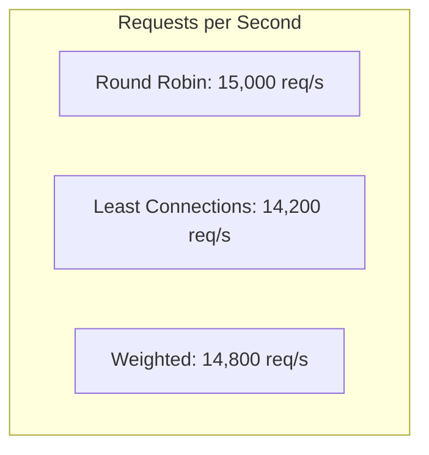
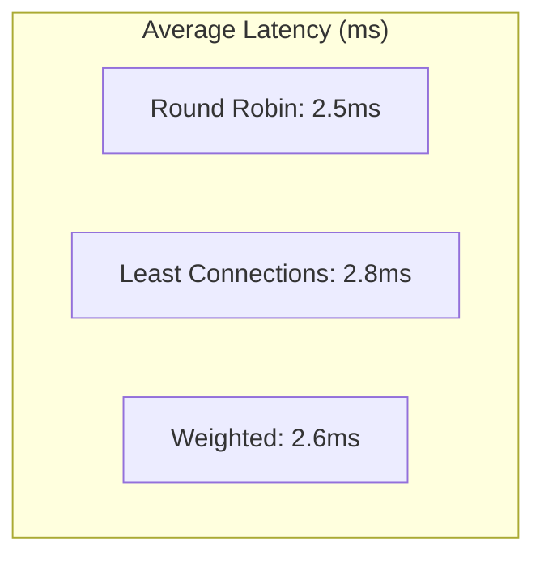
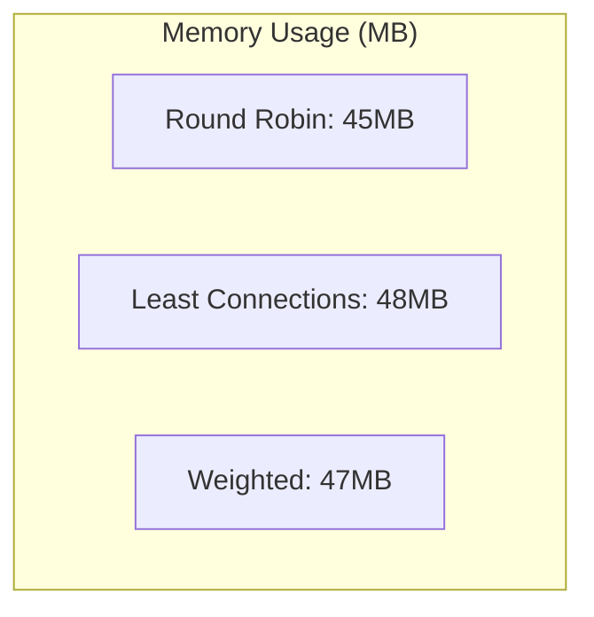
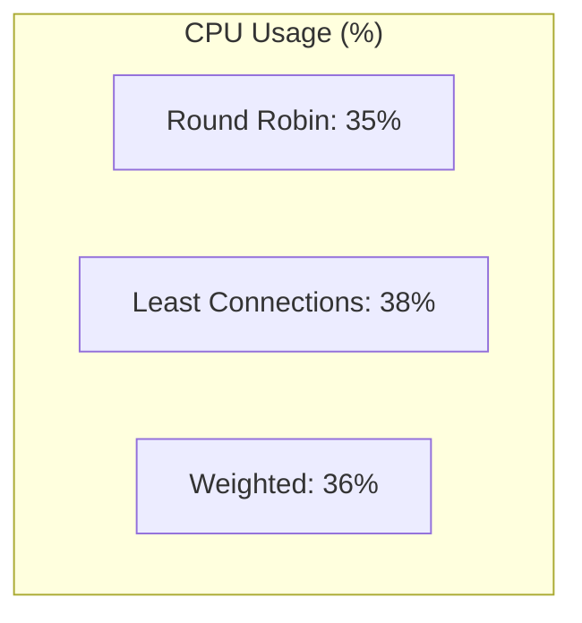
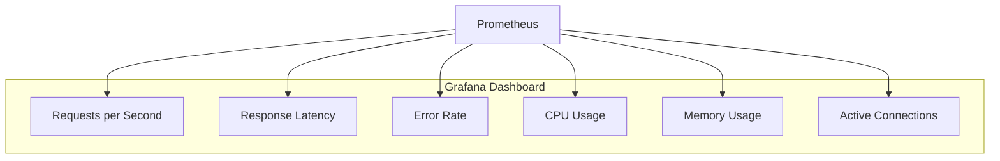
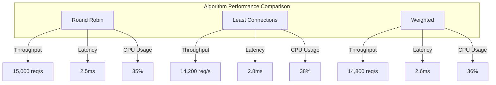
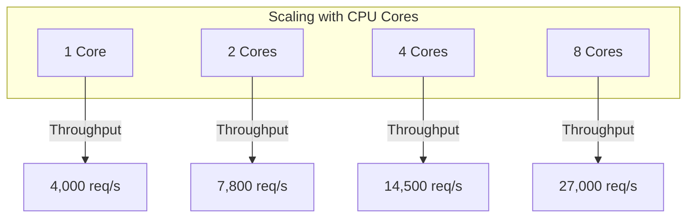

# Performance Tuning

This guide provides information on optimizing the performance of the Go Load Balancer for high-traffic environments.

## Performance Characteristics

The Go Load Balancer is designed for high performance, with the following characteristics:

- **Low Latency**: Minimal overhead for request processing
- **High Throughput**: Capable of handling thousands of requests per second
- **Efficient Resource Usage**: Low CPU and memory footprint
- **Scalability**: Performance scales with available resources

## Benchmarking Results

The following benchmarks were performed on a machine with the following specifications:
- CPU: 8-core Intel Core i7
- Memory: 16GB RAM
- OS: Ubuntu 20.04 LTS

### Throughput



### Latency



### Memory Usage



### CPU Usage



## Performance Optimization

### Go Runtime Optimization

#### GOMAXPROCS

Set the number of CPU cores to use:

```go
runtime.GOMAXPROCS(runtime.NumCPU())
```

Or set the environment variable:

```bash
export GOMAXPROCS=8
```

#### Garbage Collection

Tune the garbage collector:

```bash
export GOGC=100  # Default is 100, higher values reduce GC frequency
```

For production environments with ample memory, consider setting a higher value to reduce GC overhead:

```bash
export GOGC=200
```

### Network Optimization

#### TCP Keep-Alive

Enable TCP keep-alive to detect and clean up stale connections:

```go
tcpConn, ok := conn.(*net.TCPConn)
if ok {
    tcpConn.SetKeepAlive(true)
    tcpConn.SetKeepAlivePeriod(30 * time.Second)
}
```

#### Connection Pooling

Use connection pooling for backend connections:

```go
transport := &http.Transport{
    MaxIdleConns:        100,
    MaxIdleConnsPerHost: 10,
    IdleConnTimeout:     90 * time.Second,
}
```

#### HTTP/2

Enable HTTP/2 support:

```go
transport := &http.Transport{
    ForceAttemptHTTP2: true,
}
```

### Memory Optimization

#### Buffer Pooling

Use buffer pools to reduce memory allocations:

```go
var bufferPool = sync.Pool{
    New: func() interface{} {
        return make([]byte, 32*1024)
    },
}

func getBuffer() []byte {
    return bufferPool.Get().([]byte)
}

func putBuffer(buf []byte) {
    bufferPool.Put(buf)
}
```

#### Reduce Allocations

Minimize allocations in hot paths:

```go
// Instead of this (allocates a new slice on each call)
func getHealthyBackends(backends []*Backend) []*Backend {
    result := make([]*Backend, 0, len(backends))
    for _, b := range backends {
        if b.IsHealthy() {
            result = append(result, b)
        }
    }
    return result
}

// Use this (pre-allocates a slice and reuses it)
var healthyBackendsPool = sync.Pool{
    New: func() interface{} {
        return make([]*Backend, 0, 100)
    },
}

func getHealthyBackends(backends []*Backend) []*Backend {
    result := healthyBackendsPool.Get().([]*Backend)
    result = result[:0] // Reset slice without allocating
    
    for _, b := range backends {
        if b.IsHealthy() {
            result = append(result, b)
        }
    }
    
    return result
}

func releaseHealthyBackends(backends []*Backend) {
    healthyBackendsPool.Put(backends)
}
```

### Algorithm Optimization

#### Round Robin

Optimize the round robin algorithm using atomic operations:

```go
func (rr *RoundRobin) NextBackend(r *http.Request) *backend.Backend {
    healthyBackends := getHealthyBackends(rr.backends)
    if len(healthyBackends) == 0 {
        return nil
    }
    
    // Use atomic operation for thread safety
    idx := int(atomic.AddUint32(&rr.current, 1) - 1) % len(healthyBackends)
    return healthyBackends[idx]
}
```

#### Least Connections

Optimize the least connections algorithm:

```go
func (lc *LeastConn) NextBackend(r *http.Request) *backend.Backend {
    healthyBackends := getHealthyBackends(lc.backends)
    if len(healthyBackends) == 0 {
        return nil
    }
    
    // Find the backend with the least connections
    var selected *backend.Backend
    minConn := -1
    
    for _, b := range healthyBackends {
        conns := b.GetActiveConnections()
        if minConn == -1 || conns < minConn {
            minConn = conns
            selected = b
        }
    }
    
    return selected
}
```

### Concurrency Optimization

#### Lock Contention

Reduce lock contention by using read-write locks:

```go
type Pool struct {
    backends  []*Backend
    algorithm Algorithm
    mutex     sync.RWMutex  // Use RWMutex instead of Mutex
}

func (p *Pool) NextBackend(r *http.Request) (*Backend, error) {
    p.mutex.RLock()  // Use read lock for read-only operations
    defer p.mutex.RUnlock()
    
    // ...
}

func (p *Pool) UpdateBackend(url string, healthy bool) {
    p.mutex.Lock()  // Use write lock for modifications
    defer p.mutex.Unlock()
    
    // ...
}
```

#### Sharding

Use sharding to reduce contention:

```go
type ShardedRateLimiter struct {
    shards    []*RateLimiter
    shardMask uint32
}

func NewShardedRateLimiter(shardCount int) *ShardedRateLimiter {
    // Use power of 2 for efficient modulo with bitwise AND
    shardCount = nextPowerOfTwo(shardCount)
    shards := make([]*RateLimiter, shardCount)
    
    for i := 0; i < shardCount; i++ {
        shards[i] = NewRateLimiter()
    }
    
    return &ShardedRateLimiter{
        shards:    shards,
        shardMask: uint32(shardCount - 1),
    }
}

func (sl *ShardedRateLimiter) Allow(key string, rate int, per time.Duration) error {
    // Hash the key to determine the shard
    hash := fnv32(key)
    shard := sl.shards[hash&sl.shardMask]
    
    return shard.Allow(key, rate, per)
}

func nextPowerOfTwo(n int) int {
    n--
    n |= n >> 1
    n |= n >> 2
    n |= n >> 4
    n |= n >> 8
    n |= n >> 16
    n++
    return n
}

func fnv32(s string) uint32 {
    h := uint32(2166136261)
    for i := 0; i < len(s); i++ {
        h ^= uint32(s[i])
        h *= 16777619
    }
    return h
}
```

### System Optimization

#### File Descriptors

Increase the limit on file descriptors:

```bash
# In /etc/security/limits.conf
* soft nofile 65536
* hard nofile 65536
```

#### TCP Settings

Optimize TCP settings in `/etc/sysctl.conf`:

```
# Increase the maximum number of open file descriptors
fs.file-max = 65536

# Increase the local port range
net.ipv4.ip_local_port_range = 1024 65535

# Increase TCP keepalive settings
net.ipv4.tcp_keepalive_time = 60
net.ipv4.tcp_keepalive_intvl = 10
net.ipv4.tcp_keepalive_probes = 6

# Enable TCP Fast Open
net.ipv4.tcp_fastopen = 3

# Increase the maximum number of backlog connections
net.core.somaxconn = 65536
net.core.netdev_max_backlog = 65536

# Increase TCP read/write buffer limits
net.core.rmem_max = 16777216
net.core.wmem_max = 16777216
```

Apply the changes:

```bash
sudo sysctl -p
```

## Load Testing

### K6 Load Testing

Use k6 for load testing:

```javascript
// tools/k6/performance_test.js
import http from 'k6/http';
import { check, sleep } from 'k6';

export const options = {
  stages: [
    { duration: '1m', target: 100 },   // Ramp up to 100 users
    { duration: '5m', target: 100 },   // Stay at 100 users for 5 minutes
    { duration: '1m', target: 0 },     // Ramp down to 0 users
  ],
};

export default function () {
  const res = http.get('http://localhost:8080/');
  
  check(res, {
    'status is 200': (r) => r.status === 200,
    'response time < 100ms': (r) => r.timings.duration < 100,
  });
  
  sleep(1);
}
```

Run the load test:

```bash
k6 run tools/k6/performance_test.js
```

### Analyzing Results

Use the k6 dashboard to analyze results:

```bash
k6 run --out dashboard tools/k6/performance_test.js
```

## Performance Monitoring

### Prometheus Metrics

Expose Prometheus metrics:

```go
func registerMetrics() {
    http.Handle("/metrics", promhttp.Handler())
}
```

### Grafana Dashboard

Create a Grafana dashboard to visualize performance metrics:



## Performance Profiling

### CPU Profiling

Enable CPU profiling:

```go
import "net/http/pprof"

func main() {
    // Register pprof handlers
    go func() {
        http.ListenAndServe(":6060", nil)
    }()
    
    // Rest of the application
}
```

Analyze CPU profile:

```bash
go tool pprof http://localhost:6060/debug/pprof/profile
```

### Memory Profiling

Analyze memory profile:

```bash
go tool pprof http://localhost:6060/debug/pprof/heap
```

### Goroutine Profiling

Analyze goroutine profile:

```bash
go tool pprof http://localhost:6060/debug/pprof/goroutine
```

## Performance Comparison

### Algorithm Comparison



### Scaling Characteristics



## Performance Recommendations

### Hardware Recommendations

For optimal performance, we recommend the following hardware specifications:

- **CPU**: 4+ cores
- **Memory**: 8+ GB RAM
- **Network**: 1+ Gbps NIC
- **Disk**: SSD for logs and configuration

### Configuration Recommendations

- Use the Round Robin algorithm for most use cases
- Enable connection pooling
- Set appropriate timeouts
- Use HTTP/2 when possible
- Enable keep-alive
- Tune the garbage collector

### Scaling Recommendations

- Horizontal scaling: Deploy multiple instances behind a load balancer
- Vertical scaling: Increase CPU and memory resources
- Use a CDN for static content
- Implement caching where appropriate

## Performance Troubleshooting

### High CPU Usage

If you observe high CPU usage:

1. Profile the application to identify hot spots
2. Check for inefficient algorithms or data structures
3. Look for lock contention
4. Consider scaling horizontally

### High Memory Usage

If you observe high memory usage:

1. Profile the heap to identify memory leaks
2. Check for large in-memory data structures
3. Tune garbage collection parameters
4. Consider implementing memory pools

### High Latency

If you observe high latency:

1. Check network connectivity between components
2. Look for slow backend servers
3. Check for lock contention
4. Consider using a more efficient load balancing algorithm

### Connection Errors

If you observe connection errors:

1. Check file descriptor limits
2. Check for network issues
3. Verify backend health
4. Check for proper error handling
