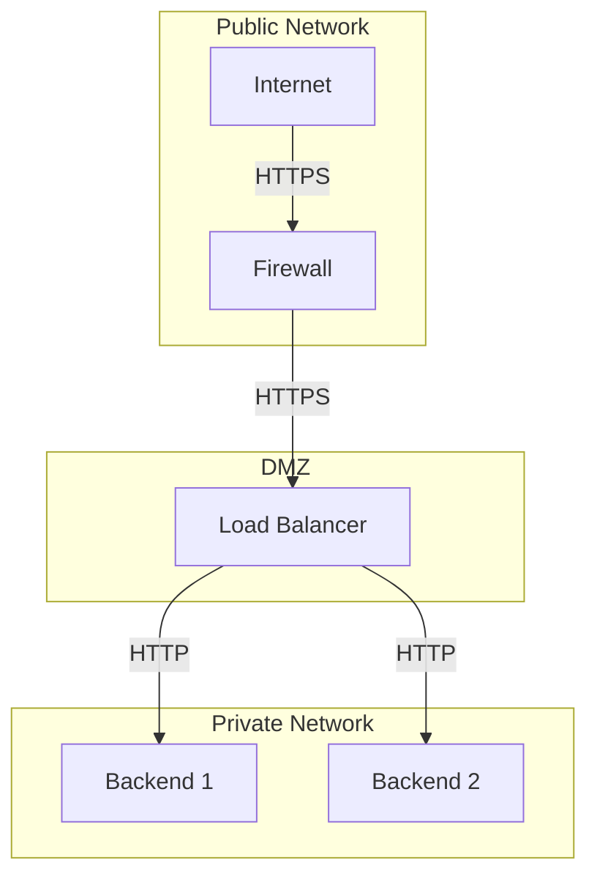
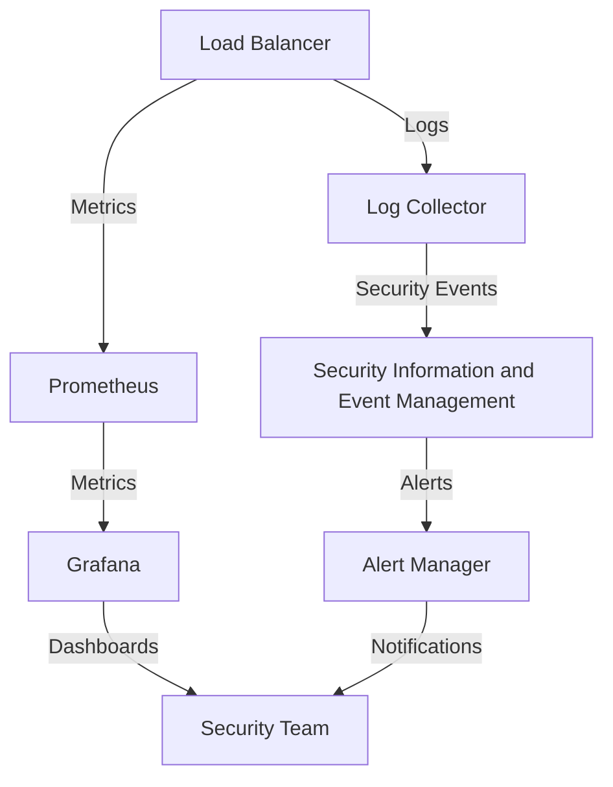
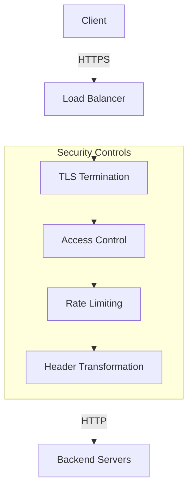

# Security Considerations

This document outlines security considerations and best practices for deploying and operating the Go Load Balancer.

## Security Overview

The Go Load Balancer is designed with security in mind, providing several features to help secure your infrastructure:

- TLS termination
- IP-based access control
- Rate limiting
- Header validation and transformation
- Secure defaults

## Network Security

### TLS Configuration

The load balancer supports TLS termination for secure client connections. Configure TLS in your configuration file:

```yaml
server:
  address: ":443"
  tls_cert: "/path/to/cert.pem"
  tls_key: "/path/to/key.pem"
```

For optimal security, use the following TLS configuration:

```go
tlsConfig := &tls.Config{
    MinVersion:               tls.VersionTLS12,
    CurvePreferences:         []tls.CurveID{tls.X25519, tls.CurveP256},
    PreferServerCipherSuites: true,
    CipherSuites: []uint16{
        tls.TLS_ECDHE_ECDSA_WITH_AES_256_GCM_SHA384,
        tls.TLS_ECDHE_RSA_WITH_AES_256_GCM_SHA384,
        tls.TLS_ECDHE_ECDSA_WITH_CHACHA20_POLY1305,
        tls.TLS_ECDHE_RSA_WITH_CHACHA20_POLY1305,
        tls.TLS_ECDHE_ECDSA_WITH_AES_128_GCM_SHA256,
        tls.TLS_ECDHE_RSA_WITH_AES_128_GCM_SHA256,
    },
}
```

### Network Isolation

Deploy the load balancer in a secure network architecture:



### Firewall Rules

Implement firewall rules to restrict access to the load balancer:

- Allow incoming connections only on necessary ports (e.g., 80, 443)
- Allow outgoing connections only to backend servers
- Block all other traffic

Example iptables rules:

```bash
# Allow incoming HTTP/HTTPS
iptables -A INPUT -p tcp --dport 80 -j ACCEPT
iptables -A INPUT -p tcp --dport 443 -j ACCEPT

# Allow outgoing connections to backend servers
iptables -A OUTPUT -p tcp --dport 8080 -d 10.0.0.0/24 -j ACCEPT

# Allow established connections
iptables -A INPUT -m state --state ESTABLISHED,RELATED -j ACCEPT

# Drop all other traffic
iptables -A INPUT -j DROP
iptables -A OUTPUT -j DROP
```

## Access Control

### IP-Based Access Control

The load balancer includes an IP-based access control system. Configure it in your routing rules:

```yaml
routing_rules:
  - match:
      path: "/admin/*"
    target_pool: "admin-servers"
    policies:
      - acl: "allow:192.168.1.0/24,deny:0.0.0.0/0"
```

### Authentication and Authorization

While the load balancer doesn't directly handle authentication, you can implement it using header-based routing and transformations:

```yaml
routing_rules:
  - match:
      path: "/api/*"
      headers:
        Authorization: "Bearer .*"
    target_pool: "api-servers"
    policies:
      - transform: "add-header:X-Authenticated:true"
  
  - match:
      path: "/api/*"
    target_pool: "auth-servers"
```

## Rate Limiting

Configure rate limiting to protect against DoS attacks:

```yaml
routing_rules:
  - match:
      path: "/api/*"
    target_pool: "api-servers"
    policies:
      - rate_limit: "100/minute"
```

The rate limiter uses a token bucket algorithm and is keyed by client IP address.

## Header Security

### Security Headers

Add security headers to responses:

```yaml
routing_rules:
  - match:
      path: "/*"
    target_pool: "web-servers"
    policies:
      - transform: "add-header:Strict-Transport-Security:max-age=31536000; includeSubDomains,add-header:X-Content-Type-Options:nosniff,add-header:X-Frame-Options:DENY,add-header:Content-Security-Policy:default-src 'self'"
```

### Header Validation

Validate and sanitize headers to prevent injection attacks:

```go
func sanitizeHeaders(r *http.Request) {
    // Remove potentially dangerous headers
    r.Header.Del("X-Forwarded-Host")
    
    // Add safe headers
    r.Header.Set("X-Forwarded-For", getClientIP(r))
}
```

## Secure Deployment

### Running as Non-Root

Run the load balancer as a non-root user:

```dockerfile
FROM golang:1.18-alpine AS builder
# ... build steps ...

FROM alpine:3.16
RUN addgroup -S loadbalancer && adduser -S loadbalancer -G loadbalancer
USER loadbalancer
# ... rest of Dockerfile ...
```

### Container Security

Secure your container deployment:

```dockerfile
FROM golang:1.18-alpine AS builder
# ... build steps ...

FROM alpine:3.16
# Add non-root user
RUN addgroup -S loadbalancer && adduser -S loadbalancer -G loadbalancer

# Install security updates
RUN apk update && apk upgrade

# Set permissions
COPY --from=builder --chown=loadbalancer:loadbalancer /go-lb /app/go-lb
COPY --from=builder --chown=loadbalancer:loadbalancer /configs /app/configs

# Set security options
USER loadbalancer
WORKDIR /app
EXPOSE 8080

# Use exec form for proper signal handling
ENTRYPOINT ["/app/go-lb"]
CMD ["--config", "/app/configs/config.yml"]
```

Run with security options:

```bash
docker run --security-opt=no-new-privileges --cap-drop=ALL --read-only go-loadbalancer:latest
```

### Kubernetes Security Context

When deploying to Kubernetes, use a security context:

```yaml
apiVersion: apps/v1
kind: Deployment
metadata:
  name: go-loadbalancer
spec:
  template:
    spec:
      securityContext:
        runAsUser: 1000
        runAsGroup: 1000
        fsGroup: 1000
        runAsNonRoot: true
      containers:
      - name: go-loadbalancer
        securityContext:
          allowPrivilegeEscalation: false
          capabilities:
            drop:
            - ALL
          readOnlyRootFilesystem: true
```

## Logging and Monitoring

### Security Logging

Enable security-related logging:

```yaml
logging:
  level: "info"
  security_events: true
```

Log security events:

```go
func logSecurityEvent(logger *logging.Logger, event string, r *http.Request) {
    logger.Info("Security event", 
        "event", event,
        "ip", getClientIP(r),
        "path", r.URL.Path,
        "method", r.Method,
        "user_agent", r.UserAgent(),
    )
}
```

### Security Monitoring

Monitor for security events:



## Security Hardening Checklist

- [ ] Enable TLS with strong cipher suites
- [ ] Configure proper access control
- [ ] Implement rate limiting
- [ ] Add security headers
- [ ] Run as non-root user
- [ ] Use a read-only filesystem
- [ ] Drop unnecessary capabilities
- [ ] Enable security logging
- [ ] Set up security monitoring
- [ ] Regularly update dependencies
- [ ] Perform security scanning
- [ ] Implement network isolation
- [ ] Configure firewall rules

## Vulnerability Management

### Dependency Scanning

Regularly scan dependencies for vulnerabilities:

```bash
go list -m all | xargs go-vulncheck
```

### Security Updates

Keep dependencies up to date:

```bash
go get -u all
go mod tidy
```

### Security Scanning

Scan the codebase for security issues:

```bash
gosec ./...
```

## Threat Model

The following threat model outlines potential security threats and mitigations:

| Threat | Impact | Likelihood | Mitigation |
|--------|--------|------------|------------|
| DoS Attack | High | Medium | Rate limiting, IP blocking |
| TLS Downgrade | High | Low | Strong TLS configuration |
| Backend Compromise | High | Medium | Network isolation, least privilege |
| Unauthorized Access | High | Medium | Access control, authentication |
| Data Leakage | Medium | Medium | Header filtering, TLS |
| Man-in-the-Middle | High | Low | TLS, certificate pinning |

## Security Architecture



## Security Response

### Reporting Security Issues

If you discover a security vulnerability, please follow these steps:

1. **Do not** disclose the vulnerability publicly
2. Email security@example.com with details of the vulnerability
3. Allow time for the vulnerability to be addressed before public disclosure

### Security Patches

Security patches will be released as soon as possible after a vulnerability is discovered. Users should update to the latest version to receive security fixes.

## Compliance Considerations

### GDPR Compliance

- Ensure proper handling of personal data
- Implement data minimization
- Configure appropriate logging
- Consider data residency requirements

### PCI DSS Compliance

If handling payment card data:

- Implement strong access control
- Use TLS 1.2 or higher
- Enable comprehensive logging
- Segment networks
- Regularly test security systems
