# Use Cases & Workflows

This document describes the key use cases and workflows of the Go Load Balancer, illustrating how the system handles different scenarios.

## Core Workflows

### Request Processing Workflow

The primary workflow of the load balancer is processing and routing HTTP requests to backend servers.

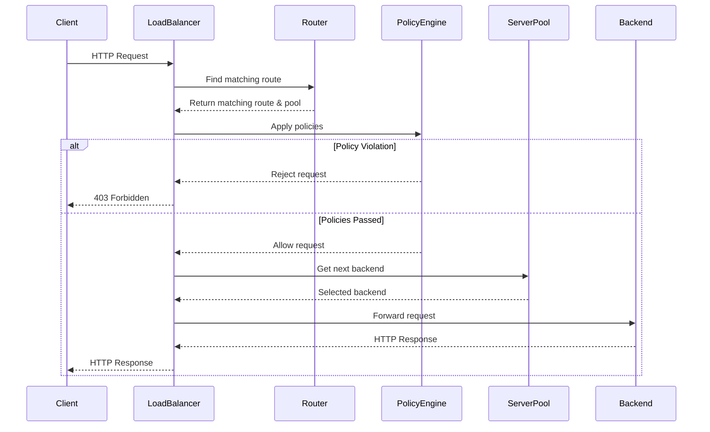

### Health Check Workflow

The health checker continuously monitors backend servers to ensure they are operational.

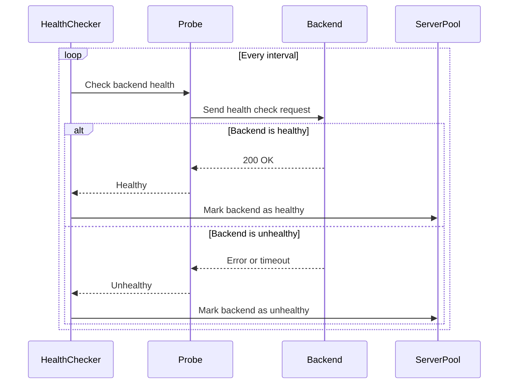

### Configuration Reload Workflow

The load balancer supports runtime configuration updates through the admin API.

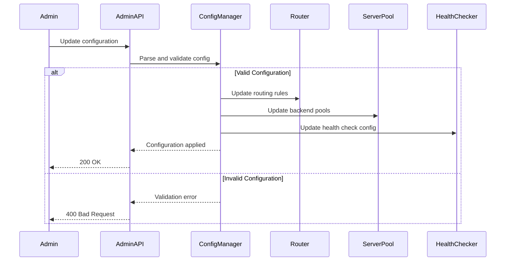

## Use Cases

### Use Case 1: API Gateway

Using the load balancer as an API gateway to route requests to different microservices.

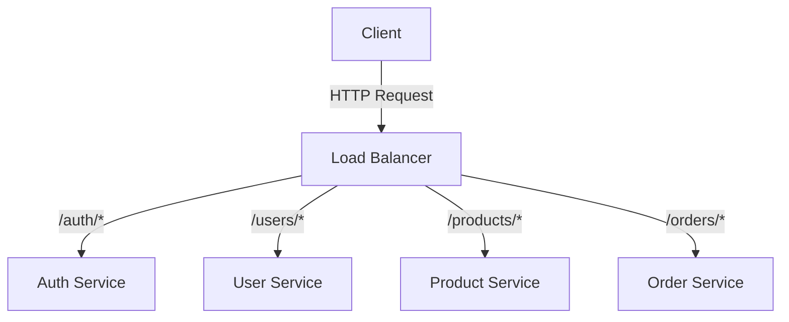

Configuration:

```yaml
backend_pools:
  - name: "auth-service"
    algorithm: "round_robin"
    backends:
      - url: "http://auth-service:8000"
  - name: "user-service"
    algorithm: "round_robin"
    backends:
      - url: "http://user-service:8000"
  - name: "product-service"
    algorithm: "round_robin"
    backends:
      - url: "http://product-service:8000"
  - name: "order-service"
    algorithm: "round_robin"
    backends:
      - url: "http://order-service:8000"

routing_rules:
  - match:
      path: "/auth/*"
    target_pool: "auth-service"
  - match:
      path: "/users/*"
    target_pool: "user-service"
  - match:
      path: "/products/*"
    target_pool: "product-service"
  - match:
      path: "/orders/*"
    target_pool: "order-service"
```

### Use Case 2: High Availability Web Service

Using the load balancer to distribute traffic across multiple web servers for high availability.

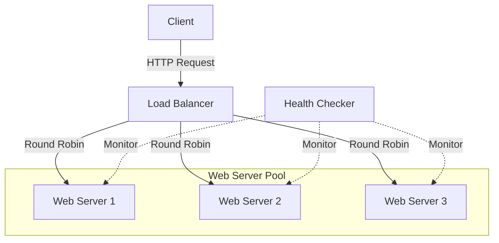

Configuration:

```yaml
backend_pools:
  - name: "web-servers"
    algorithm: "round_robin"
    backends:
      - url: "http://web1:80"
      - url: "http://web2:80"
      - url: "http://web3:80"
    health_check:
      path: "/health"
      interval: "10s"
      timeout: "2s"

routing_rules:
  - match:
      path: "/*"
    target_pool: "web-servers"
```

### Use Case 3: A/B Testing

Using the load balancer to split traffic between different versions of a service for A/B testing.

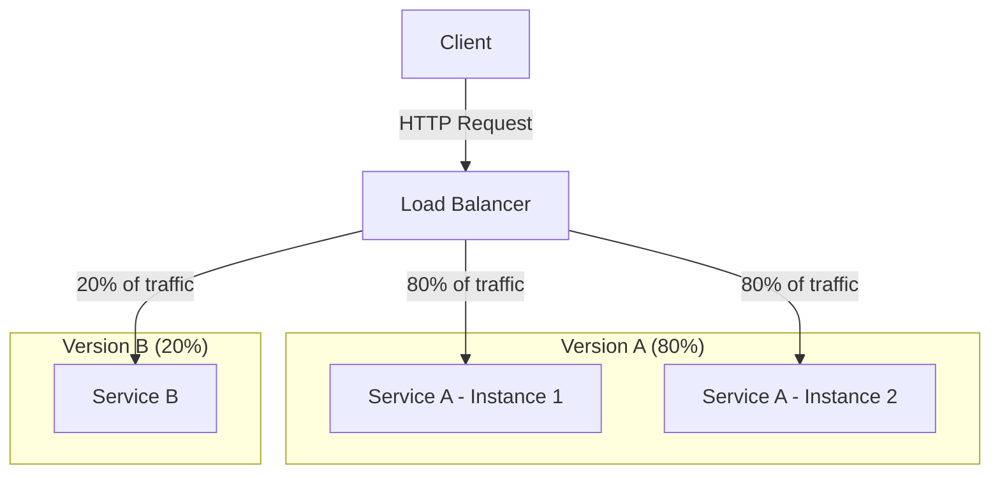

Configuration:

```yaml
backend_pools:
  - name: "service-a"
    algorithm: "round_robin"
    backends:
      - url: "http://service-a-1:8000"
      - url: "http://service-a-2:8000"
  - name: "service-b"
    algorithm: "round_robin"
    backends:
      - url: "http://service-b:8000"

routing_rules:
  - match:
      headers:
        X-Test-Group: "B"
    target_pool: "service-b"
  - match:
      path: "/*"
    target_pool: "service-a"
```

### Use Case 4: Rate Limiting and Security

Using the load balancer to apply rate limiting and security policies to protect backend services.

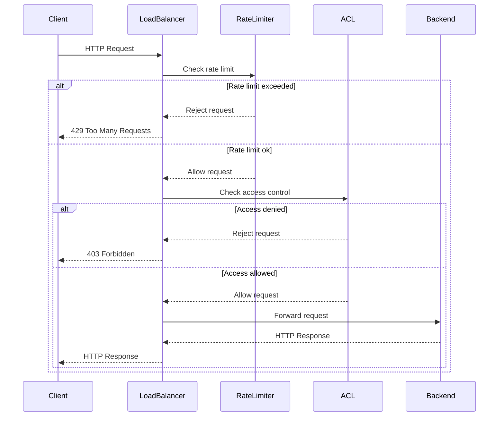

Configuration:

```yaml
backend_pools:
  - name: "api-servers"
    algorithm: "least_conn"
    backends:
      - url: "http://api1:8000"
      - url: "http://api2:8000"

routing_rules:
  - match:
      path: "/api/*"
    target_pool: "api-servers"
    policies:
      - rate_limit: "100/minute"
      - acl: "allow:192.168.1.0/24,deny:10.0.0.1"
```

### Use Case 5: Header Transformation

Using the load balancer to transform headers for backend compatibility.

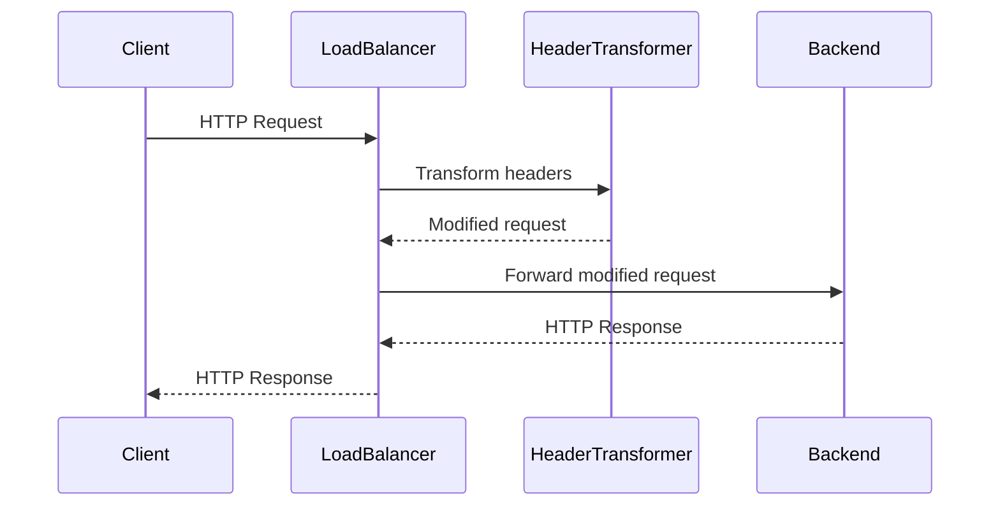

Configuration:

```yaml
routing_rules:
  - match:
      path: "/api/*"
    target_pool: "api-servers"
    policies:
      - transform: "add-header:X-Forwarded-Host:api.example.com,remove-header:Referer"
```

## Advanced Workflows

### Blue-Green Deployment

Using the load balancer to implement blue-green deployments for zero-downtime updates.

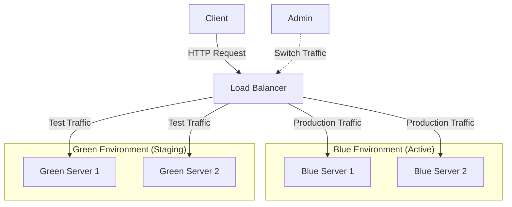

### Canary Deployment

Using the load balancer to implement canary deployments for gradual rollouts.

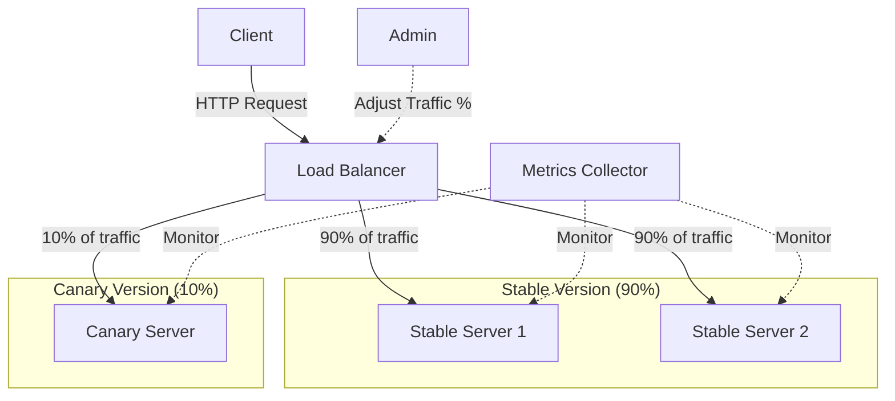

### Circuit Breaking

Using the load balancer to implement circuit breaking for fault tolerance.

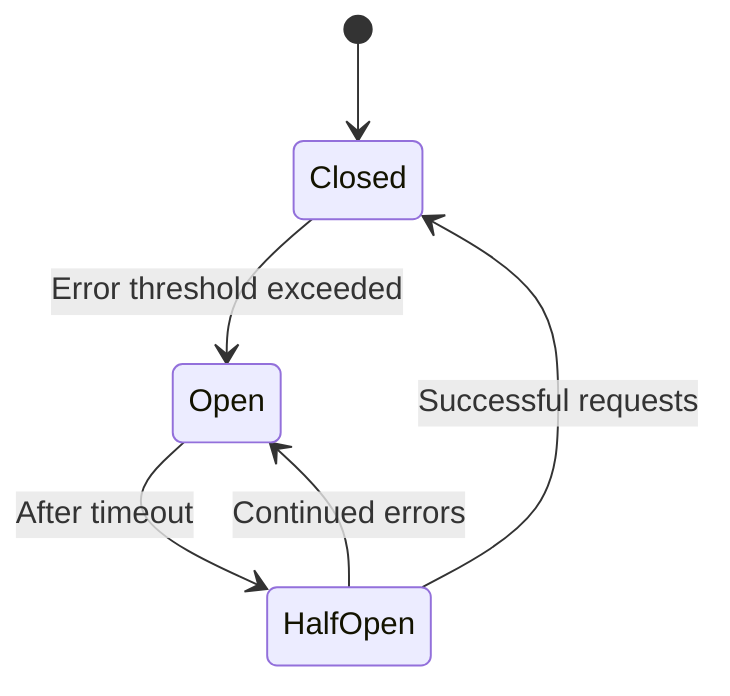

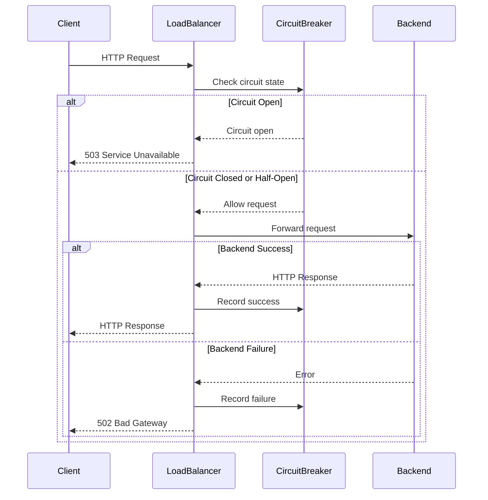
